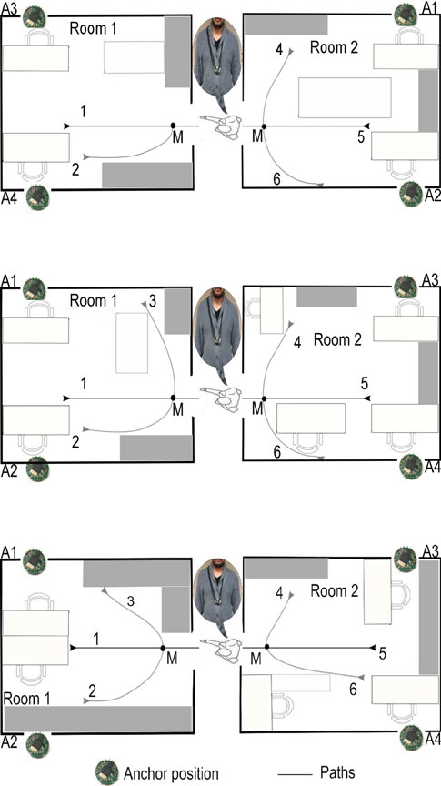

# Introduction

Ceci est l'analyse pour la tâche d'analyse de classification multi-classe sur la dataset *"Indoor User Movement Prediction from RSS data Data Set"*.

L'objectif est de prédire le pattern des mouvements des utilisateurs dans un environmment de travail à travers des séries temporelles générées par un réseau de capteurs sans-fils. Les données contiennent des streams de données temporelles, consistant en la force des signaux radios mesurés entre les noeuds du réseau de capteurs sans-fils, à une fréquence de 8 Hz remappées dans l'intervalle [-1, 1].

Ce réseau se compose de 5 capteurs:

* 4 ancrées dans l'environnement
* 1 ancrée sur l'utilisateur

La tache nécessite de prédire la classe indiquant la trajectoire d'un utilisateur, parmi 6 mouvements spécifiques.

On dispose de 314 séquences, pour un nombre total de 13197 étapes. De fait, les séries n'ont pas forcément la même durée.

A noter : la première dataset ne possède pas la classe 3 due à des contraintes physiques. En conséquence, il sera intéressent de vérifier toute différence potentielle entre les prédictions selon les datasets utilisées pour l'entrainement/validation.

Note: le CSS a été modifié manuellement. La première occurrence de "840" (ou "1200" pour le notebook) est remplacée par 1240 (ou "1600" pour le notebok) pour mieux couvrir l'espace horizontal. Vous pouvez modifier le CSS manuellement dans le cas où votre définition d'écran est trop faible pour 1240 (ou 1600) pixels.

L'intégralité des modèles et datasets intermédiaires sont exportées par le script.

## Préparation

Avant de commencer toute recherche, nous devons charger les données en mémoire. De plus, nous devons mettre l'encoding de R en UTF-8, puisqu'on utilise des caractères interdits au format ISO-8859-1. Cela se fait tout simplement dans RStudio via Tools > Global Options > Code > Saving > Default Text Encoding.

### Chargement des libraries

Les informations ci-dessous nous permettront de re-créer l'environnement dans lequel on travaille. Pour information, la configuration hardware est la suivante :

- Processeur : Intel i7-3930K (12 sockets virtualisés)
- RAM : 54 GB (150 GB swap)
- Carte graphique : aucune

De même, au niveau software :

- Système d'exploitation : Windows Server 2012 R2
- R: Microsoft R Client, version 3.3.2 de R + Intel MKL
- RStudio Preview, version supérieure ou égale à 1.0.136 (résolution du problème d'encoding des caractères en Markdown)
- Rtools pour R 3.3.x pour la compilation de packages pour R
- MinGW 6.2.0 pour la compilation de code C++
- Java 8 Update 111 pour l'utilisation de H2O
- Git Bash pour l'utilisation de Bash (pour MinGW)

```{r setup, include=FALSE}
# Notebook
library(knitr)
opts_knit$set(root.dir = "E:/Auxivia/") # Working directory
#opts_chunk$set(tidy = FALSE) # Code lisible et aéré
opts_chunk$set(results = "hold") # Outputs déférés en fin de chaque chunk de code
#options(formatR.blank = TRUE) # Conservation des lignes vides pour la lisibilité
opts_chunk$set(fig.align = "center") # Alignement horizontal des figures
```

```{r Librairies, results="hide", message=FALSE, warning=FALSE}
# Chargement de données
library(data.table)

# Régression linéaire en C++
library(RcppArmadillo)

# htmlwidgets / 3djs / Plotly
library(plotly)

# htmlwidgets / datatables / formattable
library(DT)
library(formattable)

# Graphique tableplot
library(tabplot)

# Machine Learning généraliste en C++
library(xgboost)

# Machine Learning généraliste en Java
library(h2o)
localH2O = h2o.init(nthreads = 1, max_mem_size = "4G") # 1 Thread (reproduction des résultats), 4GB de mémoire vive
h2o.no_progress() # Cache la barre de progression

# Optimiseur continu et discret
library(CEoptim)

# Timing
library(R.utils)

# Plein d'utilitaires
library(Laurae)

# Fonction de timing : prend un temps passé et une tâche, affiche la différence de temps au centième de seconde
timing <- function(timer, what = "?") {
  cat("Temps d'exécution de la tâche '", what, "' : ", sprintf("%.02f", ((System$currentTimeMillis() - timer) / 1000)), " secondes.  \n", sep = "") # Double espace pour éviter le bug d'espace en Markdown R
}

# Informations sur la session
sessionInfo()
```

### Chargement des données

Pour charger les données, qui se trouvent de manière séparée dans des fichiers, nous devons les ouvrir un par un. Cela se fait de manière triviale sur R par une boucle:

- Nous avons 314 fichiers numérotés de 1 à 314 (et non pas 001 à 314) sous la forme MovementAAL_RSS_X.csv (remplacer X) dans le dossier /dataset, dont la première colonne possède le caractère dièse en trop (pour marquer les colonnes) qui doit être enlevée
- Nous avons les labels dans le fichier nommé MovementAAL_target.csv dans le dossier /dataset
- Les données annexes de famille de mouvements (MovementAAL_DatasetGroup.csv) et de chemins (MovementAAL_Paths.csv) sont dans le dossier /group

```{r ChargementData}
# Compteur de temps
CurrentTime <- timer() # Chunk Chargement des données en mémoire

# Pré-initialisation des variables
data_pre <- list()

# Chargement des données
for (i in 1:314) {
  data_pre[[i]] <- fread(paste0("dataset/MovementAAL_RSS_", i, ".csv"), sep = ",", verbose = FALSE, showProgress = FALSE, col.names = c("RSS_anchor1", "RSS_anchor2", "RSS_anchor3", "RSS_anchor4"))
}

# Chargement des données annexes
labels <- fread("dataset/MovementAAL_target.csv", sep = ",", verbose = FALSE, showProgress = FALSE, col.names = c("sequence_ID", "class_label"))
labels$class_label[labels$class_label == -1] <- 0
group_room <- fread("groups/MovementAAL_DatasetGroup.csv", sep = ",", verbose = FALSE, showProgress = FALSE, col.names = c("sequence_ID", "dataset_ID"))
group_path <- fread("groups/MovementAAL_Paths.csv", sep = ",", verbose = FALSE, showProgress = FALSE, col.names = c("sequence_ID", "path_ID"))

# Temps nécessaire
timing(CurrentTime, "Chargement des données en mémoire")
```

## Première Analyse Exploratoire

### Tentative de compréhension du problème : problème inhérent aux données

Pour tenter de comprendre le problème, on va prendre les 16 derniers points de chaque série temporelle, et les afficher via 3djs via l'interface Plotly.

Il est clair et net que la Salle 1 démontre un comportement irrégulier par rapport aux deux autres salles. Une analyse trajectoire par trajectoire montre que la :

* Trajectoire 1 : canal opposé sur l'ancre 1, 2, 3, et 4
* Trajectoire 2 : canal opposé sur l'ancre 1, 2, 4, avec un gain faible sur l'ancre 3
* Trajectoire 3 : inexistance (comme prévu, d'après les énoncés - représenté par une ligne bleue fixée à 0)
* Trajectoire 4 : canal opposé sur l'ancre 1, 2, 4, avec un gain fort sur l'ancre 3
* Trajectoire 5 : canal opposé sur l'ancre 1, 2, 3, et 4
* Trajectoire 6 : canal opposé sur l'ancre 1, 2, 3, et 4

Il faudra obligatoirement réaliser une transformation sur les données de la salle 1 afin que les modèles puissent être évalués de manière fiable. Il est tout à fait possible que lors de la collecte des données, les salles 1 et 3 ont été inversées, que des ancres ont été mal positionnées, ou encore qu'il y a eu une erreur de manipulation des données pour créer les datasets par salle. Vu le problème, aucune des trois hypothèses n'est validée ni exclue.

En réalité, l'image suivante, d'après la recherche *An experimental characterization of reservoir computing in ambient assisted living applications (Bacciu et al.,2012)* explique la raison de la disparité entre la salle 1 et les deux autres salles!



Il serait intéressant de travailler à la fois sur :

- L'inversion des ancres A1/A3 et A2/A4
- La tentative de reproduction des résultats des quatre ancres

```{r AgregationProbleme}
# Compteur de temps
CurrentTime <- timer() # Chunk Agrégation des données

# Pré-initialisation de la série temporelle dépivotée par le label
# 
# Archictecture de la matrice (dépivotée sans la salle) 384x4 (64 observations par label, 16 observations par ancre par label) :
# ID  Strength    Anchor      Label       Time
#  1    val_a1         1          1          1
#  2    val_a2         1          1          2
#  ...
# 16   val_a16         1          1         16
# 17   val_a17         2          1          1
#  ...
# 32   val_a32         2          1         16
# 33   val_a33         3          1          1
#  ...
# 48   val_a48         3          1         16
# 49   val_a49         4          1          1
#  ...
# 64   val_a16         4          1         16
# 65   val_a17         1          2          1
#  ...
# ID(anchor, label, time) = ((label - 1) * 64) + ((anchor - 1) * 16) + time
avg_series <- data.table(matrix(rep(0, 16 * 4 * 6 * 6), nrow = 16 * 4 * 6, ncol = 4))
colnames(avg_series) <- c("Strength", "Anchor", "Label", "Time")

# Pré-filling des facteurs (Anchor, Label, Time)
avg_series[["Anchor"]] <- as.factor(rep(inverse.rle(list(lengths = rep(16, 4), values = 1:4)), 6))
levels(avg_series[["Anchor"]]) <- paste("Ancre", 1:4, sep = "")
avg_series[["Label"]] <- as.factor(inverse.rle(list(lengths = rep(16 * 4, 6), values = 1:6)))
levels(avg_series[["Label"]]) <- paste("Trajectoire", 1:6, sep = "")
avg_series[["Time"]] <- rep(1:16, 6 * 4)

# Transformation en liste par salle à dépivoter par la suite
avg_series <- list(cbind(avg_series, Room = rep(1, 384)),
                   cbind(avg_series, Room = rep(2, 384)),
                   cbind(avg_series, Room = rep(3, 384)))

# Pré-compte du nombre d'occurrence des labels
label_count <- list(tabulate(group_path[["path_ID"]][group_room[["dataset_ID"]] == 1]),
                    tabulate(group_path[["path_ID"]][group_room[["dataset_ID"]] == 2]),
                    tabulate(group_path[["path_ID"]][group_room[["dataset_ID"]] == 3]))

# Détermination des 16 dernières observations (2 secondes à 8 Hz), moyennisées
for (i in 1:314) {
  temp_label <- ((group_path[["path_ID"]][i] - 1) * 64) + 1 # Ligne de démarrage dans la matrice agrégée
  temp_obs <- nrow(data_pre[[i]]) - 15 # Ligne de démarrage dans la matrice à sauvegarder
  
  avg_series[[group_room[["dataset_ID"]][i]]][temp_label:(temp_label + 63), 1] <- avg_series[[group_room[["dataset_ID"]][i]]][temp_label:(temp_label + 63), 1] + (unlist(data_pre[[i]][temp_obs:(temp_obs + 15), ]) / label_count[[group_room[["dataset_ID"]][i]]][group_path[["path_ID"]][i]])
}

# Dépivotage de la variable définissant la salle
avg_series <- rbind(avg_series[[1]], avg_series[[2]], avg_series[[3]])
avg_series[["Room"]] <- as.factor(inverse.rle(list(lengths = rep(384, 3), values = 1:3)))
levels(avg_series[["Room"]]) <- paste("Salle", 1:3, sep = "")

# Affichage sous forme de plot interactif de manière automatisée
ggplotly(ggplot(data = avg_series, aes_string(x = "Time", y = "Strength", group = "Label", color = "Label")) + geom_line() + geom_point() + scale_color_brewer(palette = "Set2") + theme_bw() + facet_grid(Anchor ~ Room) + labs(title = "Evolution de la force du signal de l'ancre par rapport au temps"), width = 960, height = 720)

# Enregistrement de la table pour usage ultérieur si nécessaire
fwrite(avg_series, "agregation/agregation1.csv")

# Temps nécessaire
timing(CurrentTime, "Agrégation des données")
```

### Création de features

Pour créer un benchmark rapide basé sur les données et s'accomoder des tailles différentes des variables, on créé les différentes (36) features :

- Coefficient linéaires multiplicateurs par modèle linéaire entre chaque ancre (trois ancres estiment une ancre) (16 features) => ces features doivent pouvoir répondre à la direction linéaire probable de la personne, par ancre
- Résidus des modèles linéaires (16 features) => ces features doivent annoncer l'incertitude linéaire de la personne, par ancre
- Le dernier point avant d'observation enregistré (4 features) => ces features doivent permettre de positionner la personne juste avant sa trajectoire future

On évitera de tenter de prédire le mouvement d'une personne au niveau local 8 secondes plus tard, puisqu'on ne dispose pas forcément d'un jeu de données large par série temporelle (sans oublier que les quatre ancres sont dépendentes l'une de l'autre, donc prédire l'une nécessite de prédire les trois autres également et simultanément si possible).

```{r CreationFeature1}
# Compteur de temps
CurrentTime <- timer() # Chunk Création des features

# Pré-initialisation de la frame
mini_lm <- data.frame(matrix(nrow = 314, ncol = 36))

# Boucle par série temporelle
for (i in 1:314) {
  
  # Boucle par ancre
  for (j in 1:4) {
    
    # Entrainement d'un modèle linéaire utilisant les autres ancres, avec l'interceptrice
    temp_model <- fastLmPure(X = cbind(as.matrix(data_pre[[i]][, (1:4)[-j], with = FALSE]), rep(1, nrow(data_pre[[i]]))), y = data_pre[[i]][[j]])
    
    # Enregistrement des coefficients et des résidus
    mini_lm[i, (j * 8 - 7):(j * 8)] <- c(temp_model$coefficients, temp_model$stderr)
    
  }
  
  # Ajout du dernier élément de la série temporelle (4 ancres)
  mini_lm[i, 33:36] <- data_pre[[i]][nrow(data_pre[[i]]), ]
  
}

# Enregistrement des données au format CSV
fwrite(cbind(mini_lm, Group = group_room[["dataset_ID"]], Label = group_path[["path_ID"]]), "features/features1.csv")

# Temps nécessaire
timing(CurrentTime, "Création des features")
```

### Feature Map

On enregistre le nom des features dans un fichier à part (Feature map = "Vecteur de données => Espace de features", ici une colonne = une feature). Il est utile de faire correspondre des colonnes à des variables, surtout lorsque parfois on utilise des techniques de remapping (exemple : [kernel trick](https://medium.com/@Laurae2/using-your-brain-for-smart-transformations-of-data-8fa853bcf350#.cdyq5tbt7)).

```{r FeatureMap}
cat(c(paste0(rep(c(paste0("Coef", 1:4), paste0("Rési", 1:4)), 4), paste0("_", inverse.rle(list(lengths = rep(8, 4), values = 1:4)))), paste0("PosInitiale_", 1:4)), sep = ", ", file = "features/map.csv", append = FALSE)
```

# Première Analyse Systémique

L'analyse systémique porte sur la performance des modèles en utilisant leurs paramètres par défaut, en couvrant si possible plusieurs différent types de modèles :

```{r TableauModeles, echo=FALSE, message=FALSE, warnings=FALSE, results='asis'}
# Pas d'autres moyens simples cross-plateformes + cross-fichiers
temp_print <- "| Type de modèle | Description | Wrapper |
|------------------|-----------------------------------|:-------------------:|
| Linéaire | Régression logistique (on utilisera le modèle linéaire généralisé) | xgboost (C++), H2O (Java) |
| Non-linéaire sans ensemble | Arbre de décision (on utilisera une itération de boosting d'arbres de décision) | xgboost (C++), H2O (Java) |
| Non-linéaire d'underfitting | Arbre de décision (on utilisera le modèle de Random Forest) | xgboost (C++), H2O (Java) |
| Non-linéaire d'overfitting | Arbre de décision (on utilisera le modèle d'arbres de décision boosté) | xgboost (C++), H2O (Java) |
| Linéaire d'overfitting | Réseaux de neurones (on testera une architecture 32x6 + ReLU / Tanh, 16x16x6 + ReLU / Tanh) | H2O (Java) |"
cat(temp_print) # Affiche la table tel quel au format Markdown
```

Par simplicité, on utilisera xgboost, qui est un modèle codé en C++ dont la vitesse de calcul (et l'essentiel de la paramétrisation) est inégalée (mis à part LightGBM par Microsoft), ainsi que H2O codé en Java (relativement beaucoup plus lent, même si plus rapide que la plupart des libraries de machine learning). Nous ne sauvegardons pas encore de modèles. Ces deux libraries disposent de modèles exportables qui peuvent être enregistrés et déployés respectivement en C/shell (xgboost) et Java (H2O) pour un usage immédiat.

Nous n'utilisons pas un KNN (voisins les plus proches) ni un SVM (Support Vector Machines) pour leurs problèmes d'entrainement et de déploiement (KNN défère l'entrainement à la prédiction, et SVM a une complexité de calcul telle que ce ne sont pas des modèles déployables de manière efficiente en entreprise).

Les objectifs seront les suivants :

- Minimiser l'erreur de classification
- Ne pas dépasser 25% de features (52) par rapport au nombre d'observations par fold pour éviter le surapprentissage des features (qui ne se repérera pas sur les métriques de validation avec si peu d'échantillons, qui est le problème de fluctuation par erreur)
- Dépasser le seuil du modèle "aléatoire" (53/210 + 53/208 + 52/210, soit `r sprintf("05.02f", 100 * (53/210 + 53/208 + 52/210))`%)

On prépare d'abord les pré-requis pour le calcul, qui sont :

- Les folds à utiliser pour la cross-validation : on découpera de manière disjointe les salles, afin d'éviter tout leakage à l'intérieur des salles (afin d'empêcher le modèle de machine learning d'apprendre les salles et non pas la généralisation à des échantillon inconnus dans de nouvelles salles)
- La métrique d'évaluation, où ici l'exactitude des prédictions est multi-classe

Comme nous allons découper selon différentes méthodes, nous devrons créer à la fois les fold de train mais aussi de test :

- Entrainement sur une salle, prédiction sur une autre salle (1 contre 1)
- Entrainement sur une salle, prédiction sur deux autres salles (1 contre 2)
- Entrainement sur deux salles, prédiction sur une autre salle (2 contre 1)

La moyenne générale sera agrégée à partir des trois moyennes agrégées (1 contre 1, 1 contre 2, et 2 contre 1). Au total, nous avons 144 modèles (12 modèles, 12 sets d'entrainement/validation) à tester. Vu la taille des données (314 observations, moins d'une centaine de features) et la mémoire vive disponible (plus de 50 GB), on peut se permettre de pré-créer toutes les datasets au lieu de les créer à la volée.

Le temps perdu à la création des datasets ici est due en grande partie due à H2O, dont les objets doivent être traduits en Java à partir de R.

Les fichiers sont enregistrés avec la nomenclature suivante :

- NL pour "No Label" (données non labellisées)
- L pour "Label" (données labellisées)
- .csv pour le format CSV (Comma-Separated Values)
- .data pour le format binaire xgboost (LightSVM compressé)

```{r GenerationDonnees1}
# Compteur de temps
CurrentTime <- timer() # Chunk Préparation de l'évaluation du modèle

# Où sauvegarder les fichiers ?
file_tag <- "1_data/"

# Initialisation de la variable qui accueillera la précision
accuracy <- data.frame(matrix(nrow = 16, ncol = 13))
colnames(accuracy) <- c("Fold", "xgb_LinearModel", "xgb_DecisionTree", "xgb_RandomForest", "xgb_GradientBoosting", "h2o_LinearModel", "h2o_DecisionTree", "h2o_RandomForest", "h2o_GradientBoosting", "h2o_NN_32x6_ReLU", "h2o_NN_32x6_Soft", "h2o_NN_16x16x6_ReLU", "h2o_NN_16x16x6_Soft")
accuracy[, 1] <- c("Fold_1v2", "Fold_1v3", "Fold_2v1", "Fold_2v3", "Fold_3v1", "Fold_3v2", "Fold_1v23", "Fold_2v13", "Fold_3v12", "Fold_12v3", "Fold_13v2", "Fold_23v1", "Moyenne_1c1", "Moyenne_1c2", "Moyenne_2c1", "Moyenne")

# Initialisation des folds pour la cross-validation
folds_train <- list()
folds_test <- list()
training_data <- list()
testing_data <- list()
training_xgb <- list()
testing_xgb <- list()
training_h2o <- list()
testing_h2o <- list()
combinations_train <- c(list(1, 1, 2, 2, 3, 3), combn(3, 1, simplify = FALSE), combn(3, 2, simplify = FALSE))
combinations_test <- c(list(2, 3, 1, 3, 1, 2), rev(combn(3, 2, simplify = FALSE)), rev(combn(3, 1, simplify = FALSE)))
temp_factors <- as.factor(group_path$path_ID)

# Création des données d'entrainement et de validation
for (i in 1:12) {
  
  # Création des folds d'entrainement et de validation
  folds_train[[i]] <- which(group_room[["dataset_ID"]] %in% combinations_train[[i]])
  folds_test[[i]] <- which(group_room[["dataset_ID"]] %in% combinations_test[[i]])
  
  # Recherche et suppression du label 3 lorsque la salle 1 est isolée (soit en train on enlève en test, soit en test on enlève en train)
  if ((length(combinations_train[[i]]) == 1) & (combinations_train[[i]][1] == 1)) {
    folds_test[[i]] <- folds_test[[i]][group_path$path_ID[folds_test[[i]]] != 3]
  }
  if ((length(combinations_test[[i]]) == 1) & (combinations_test[[i]][1] == 1)) {
    folds_train[[i]] <- folds_train[[i]][group_path$path_ID[folds_train[[i]]] != 3]
  }
  
  # Création des données d'entrainement et de validation
  training_data[[i]] <- mini_lm[folds_train[[i]], ]
  testing_data[[i]] <- mini_lm[folds_test[[i]], ]
  
  # Enregistrement des données CSV
  fwrite(training_data[[i]], paste0(file_tag, "trainNL_", sprintf("%02d", i), ".csv"))
  fwrite(testing_data[[i]], paste0(file_tag, "testNL_", sprintf("%02d", i), ".csv"))
  
  # Transformation des données au format approprié pour xgboost
  training_xgb[[i]] <- xgb.DMatrix(data = as.matrix(training_data[[i]]), label = group_path$path_ID[folds_train[[i]]] - 1)
  testing_xgb[[i]] <- xgb.DMatrix(data = as.matrix(testing_data[[i]]), label = group_path$path_ID[folds_test[[i]]] - 1)
  
  # Dumping des datasets binaires xgboost
  xgb.DMatrix.save(training_xgb[[i]], paste0(file_tag, "trainL_", sprintf("%02d", i), ".data"))
  xgb.DMatrix.save(testing_xgb[[i]], paste0(file_tag, "testL_", sprintf("%02d", i), ".data"))
  
  # Transformation des données au format approprié pour H2O
  training_h2o[[i]] <- as.h2o(cbind(Label = temp_factors[folds_train[[i]]], training_data[[i]]))
  testing_h2o[[i]] <- as.h2o(cbind(Label = temp_factors[folds_test[[i]]], testing_data[[i]]))
  
  # Enregistrement des frames H2O (CSV + Label)
  h2o.exportFile(training_h2o[[i]], paste0(file_tag, "trainL_", sprintf("%02d", i), ".csv"), force = TRUE)
  h2o.exportFile(testing_h2o[[i]], paste0(file_tag, "testL_", sprintf("%02d", i), ".csv"), force = TRUE)
  
}

# Temps nécessaire
timing(CurrentTime, "Préparation de l'évaluation du modèle")
```

Dans le cas où on souhaiterait faire une classification binaire, utiliser un seuil dynamique pour découper les labels est plus adéquat (par rapport à 0.50 comme seuil). On ne réalise pas de classification binaire ici, mais cela peut toujours servir dans le futur.

```{r BinaryAccuracy}
# Le backend utilisé par xgboost pour déterminer le seuil à utiliser pour partager les labels 0 et 1
acc_eval <- function(pred, dtrain) {
  
  # Récupération du label
  y_true <- getinfo(dtrain, "label")
  
  # Création de la data.table triée avec comme clé primaire la probabilité
  DT <- data.table(y_true = y_true, y_prob = pred, key = "y_prob")
  
  # Préparation pour le nettoyage des doublons postérieurs
  cleaner <- !duplicated(DT[, "y_prob"], fromLast = TRUE)
  
  # Pré-calcul de variables spécifiques
  lens <- length(y_true)
  nump <- sum(y_true)
  
  # Détermination des vrais négatifs et des vrais positifs
  DT[, tn_v := cumsum(y_true == 0)]
  DT[, tp_v := nump - cumsum(y_true == 1)]
  
  # Nettoyage des doublons pour éviter le problème d'ordre par chance
  DT <- DT[cleaner, ]
  
  # Détermination de l'exactitude des données
  DT[, acc := (tn_v + tp_v) / lens]
  
  # Annulation à zéro pour toute observation dont le calcul aboutit à une erreur
  DT[, acc := ifelse(!is.finite(acc), 0, acc)]
  
  # Recherche de la meilleure exactitude
  best_row <- which.max(DT$acc)
  best_acc <- round(100 * DT$acc[best_row[1]], digits = 8)
  
  # Retour de la meilleure exactitude
  return(list(metric = "acc", value = best_acc))
  
}
```

## Entraînement des douze modèles

Le temps de calcul est principalement du aux modèles H2O qui prennent la majorité du temps de calcul (environ 180 secondes contre quelques secondes pour les 12x4 xgboost). Chaque modèle est entrainé sur un set d'entrainement, et testé sur un set de validation.

Pour utiliser les fichiers Java, il faut utiliser le fichier h2o-genmodel.jar adéquat trouvable ici : http://mvnrepository.com/artifact/ai.h2o/h2o-genmodel

Note : les modèles enregistrés ne sont pas forcément les meilleurs, mais contiennent le modèle final entrainé (avec potentiellement de l'overfitting).

```{r Entrainement1, cache=TRUE}
# Compteur de temps
CurrentTime <- timer() # Création et évaluation des douze modèles de benchmark

# Où sauvegarder les fichiers ?
file_tag <- "1_models/"
file_h2o <- "1_models"

xgb_dynamic_train <- function(train, test, booster, nrounds, num_parallel_trees) {
  
  # Fixation du seed du générateur de nombres aléatoires pour qu'on puisse reproduire les résultats sur d'autres machines de manière exacte
  set.seed(11111)
  
  # Entrainement du modèle
  return(xgb.train(data = train,
                   num_class = 6, # Classification à 6 classes
                   nthread = 1, # 1 coeur utilisé
                   nrounds = nrounds, # Nombre d'itérations de boosting
                   num_parallel_trees = num_parallel_trees, # Nombre d'arbres pour le mode Random Forest
                   subsample = ifelse(num_parallel_trees > 1, 0.632, 1), # Bootstrap des données pour l'échantillonnage en mode Random Forest
                   eta = 0.10, # Shrinkage pour le boosting
                   booster = booster, # Type d'entrainement : linéaire ou non-linéaire
                   objective = "multi:softprob", # Gradient/Hessian pour l'optimisation par Gradient Descent
                   eval_metric = "merror", # Inexactitude de la classification
                   maximize = FALSE, # Minimisation de l'erreur
                   early_stopping_rounds = 100, # Arrêt après 100 itérations sans amélioration de la métrique
                   verbose = FALSE, # Sans print des itérations
                   watchlist = list(test = test), # Estimation sur les données de test
                   callbacks = list(cb.evaluation.log()))) # Logging des données d'entrainement pour pouvoir récupérer les métriques
}

h2o_nn_train <- function(train, test, model_id, activation, hidden) {
  
  return(temp_model <- h2o.deeplearning(y = 1, # Label = 1ère colonne
                                        training_frame = train,
                                        validation_frame = test,
                                        model_id = model_id, # Nom du modèle
                                        standardize = FALSE, # Pas de standardisation des données, puisque [-1, 1]
                                        activation = activation, # Activation finale du réseau de neurones
                                        hidden = hidden, # Architecture du réseau de neurones
                                        epochs = 100, # Nombre de passes
                                        loss = "CrossEntropy", # Optimisation Softmax
                                        distribution = "multinomial", # Classification multi-class
                                        stopping_rounds = 10, # Arrêt après 10 itérations sans amélioration spécifique
                                        stopping_metric = "misclassification", # Minimisation de l'erreur
                                        stopping_tolerance = 0.00001, # Tolérance maximale de 0.001% de stagnation de l'erreur
                                        reproducible = TRUE, # Tentative de résultats reproductibles
                                        seed = 0)) # Reproduction des résultats
  
}

# Boucle d'évaluation
for (i in 1:12) {
  
  # Entrainement du modèle de régression logistique (xgboost)
  temp_model <- xgb_dynamic_train(train = training_xgb[[i]],
                                  test = testing_xgb[[i]],
                                  booster = "gblinear", # Linéaire
                                  nrounds = 1000000, # Arrêté au meilleur résultat
                                  num_parallel_trees = 1)
  xgb.dump(model = temp_model, # Modèle à enregistrer
           fname = paste0(file_tag, "xgb_glm_", sprintf("%02d", i), ".json"), # Où enregistrer le modèle ?
           with_stats = TRUE, # Enregistrement des statistiques si modèle gbtree
           dump_format = "json") # Dump au format json, ré-utilisable
  accuracy[i, 2] <- 1 - temp_model$evaluation_log[[2]][temp_model$best_iteration] # Récupération du meilleur résultat
  
  # Entrainement du modèle d'arbre de décision (xgboost)
  temp_model <- xgb_dynamic_train(train = training_xgb[[i]],
                                  test = testing_xgb[[i]],
                                  booster = "gbtree", # Non-linéaire
                                  nrounds = 1, # Un seul arbre
                                  num_parallel_trees = 1)
  xgb.dump(model = temp_model, # Modèle à enregistrer
           fname = paste0(file_tag, "xgb_dt_", sprintf("%02d", i), ".json"), # Où enregistrer le modèle ?
           with_stats = TRUE, # Enregistrement des statistiques si modèle gbtree
           dump_format = "json") # Dump au format json, ré-utilisable
  accuracy[i, 3] <- 1 - temp_model$evaluation_log[[2]][1] # Récupération du meilleur résultat
  
  # Entrainement du modèle de Random Forest (xgboost)
  temp_model <- xgb_dynamic_train(train = training_xgb[[i]],
                                  test = testing_xgb[[i]],
                                  booster = "gbtree", # Non-linéaire
                                  nrounds = 1, # Une seule itération
                                  num_parallel_trees = 200) # De 200 arbres
  xgb.dump(model = temp_model, # Modèle à enregistrer
           fname = paste0(file_tag, "xgb_rf_", sprintf("%02d", i), ".json"), # Où enregistrer le modèle ?
           with_stats = TRUE, # Enregistrement des statistiques si modèle gbtree
           dump_format = "json") # Dump au format json, ré-utilisable
  accuracy[i, 4] <- 1 - temp_model$evaluation_log[[2]] # Récupération du meilleur résultat
  
  # Entrainement du modèle d'arbre de décision boosté avec protection contre l'overfitting (xgboost)
  temp_model <- xgb_dynamic_train(train = training_xgb[[i]],
                                  test = testing_xgb[[i]],
                                  booster = "gbtree", # Non-linéaire
                                  nrounds = 1000000, # Arrêté au meilleur résultat
                                  num_parallel_trees = 1)
  xgb.dump(model = temp_model, # Modèle à enregistrer
           fname = paste0(file_tag, "xgb_gbt_", sprintf("%02d", i), ".json"), # Où enregistrer le modèle ?
           with_stats = TRUE, # Enregistrement des statistiques si modèle gbtree
           dump_format = "json") # Dump au format json, ré-utilisable
  accuracy[i, 5] <- 1 - temp_model$evaluation_log[[2]][temp_model$best_iteration] # Récupération du meilleur résultat
  
  # Entrainement du modèle de régression logistique (h2o)
  temp_model <- h2o.glm(y = 1,
                        training_frame = training_h2o[[i]],
                        validation_frame = testing_h2o[[i]],
                        model_id = paste0("h2o_glm_", sprintf("%02d", i)), # Nom du modèle
                        max_iterations = 100, # 100 itérations d'optimisation
                        solver = "IRLSM", # Solveur par défaut
                        standardize = FALSE, # Pas de standardisation puisque [-1, 1]
                        family = "multinomial", # Classification multi-classe
                        seed = 0, # Reproduction des résultats
                        intercept = TRUE)
  h2o.download_pojo(temp_model, # Modèle à enregistrer
                    path = file_h2o, # Où enregistrer le modèle ?
                    get_jar = FALSE) # Pas de fichier .jar
  accuracy[i, 6] <- temp_model@model$validation_metrics@metrics$hit_ratio_table[1, 2]
  
  # Entrainement du modèle d'arbre de décision (h2o)
  temp_model <- h2o.randomForest(y = 1,
                                 training_frame = training_h2o[[i]],
                                 validation_frame = testing_h2o[[i]],
                                 model_id = paste0("h2o_dt_", sprintf("%02d", i)), # Nom du modèle
                                 sample_rate = 1, # Toutes les observations seront prises en compte pour le seul arbre de décision
                                 mtries = 36, # Toutes les features seront prises en compte pour le seul arbre de décision
                                 ntrees = 1, # Un seul arbre
                                 seed = 0) # Reproduction des résultats
  h2o.download_pojo(temp_model, # Modèle à enregistrer
                    path = file_h2o, # Où enregistrer le modèle ?
                    get_jar = FALSE) # Pas de fichier .jar
  accuracy[i, 7] <- 1 - min(temp_model@model$scoring_history$validation_classification_error, na.rm = TRUE)
  
  # Entrainement du modèle de Random Forest (h2o)
  temp_model <- h2o.randomForest(y = 1,
                                 training_frame = training_h2o[[i]],
                                 validation_frame = testing_h2o[[i]],
                                 model_id = paste0("h2o_rf_", sprintf("%02d", i)), # Nom du modèle
                                 sample_rate = 0.632, # Bootstrapping .632 pour chaque arbre de décision
                                 mtries = -1, # sqrt(36) features seront prises en compte pour chaque arbre de décision
                                 ntrees = 200, # 200 arbres
                                 seed = 0) # Reproduction des résultats
  h2o.download_pojo(temp_model, # Modèle à enregistrer
                    path = file_h2o, # Où enregistrer le modèle ?
                    get_jar = FALSE) # Pas de fichier .jar
  accuracy[i, 8] <- 1 - min(temp_model@model$scoring_history$validation_classification_error, na.rm = TRUE)
  
  # Entrainement du modèle d'arbre de décision boosté avec protection contre l'overfitting (h2o)
  temp_model <- h2o.gbm(y = 1,
                      training_frame = training_h2o[[i]],
                      validation_frame = testing_h2o[[i]],
                      model_id = paste0("h2o_gbt_", sprintf("%02d", i)), # Nom du modèle
                      distribution = "multinomial", # Classification multi-classe
                      sample_rate = 1, # Pas de processus stochastique
                      ntrees = 100, # 100 itérations de boosting au maximum
                      score_each_iteration = TRUE, # Noter la valeur de chaque itération
                      stopping_rounds = 10, # Arrêt après 10 itérations sans amélioraton de la métrique
                      stopping_metric = "misclassification", # Surveiller l'inexactitude de la classification pour l'arrêt
                      stopping_tolerance = 0.00001, # Arrêter lorsque la métrique stagne de 0.001%
                      seed = 0) # Reproduction des résultats
  h2o.download_pojo(temp_model, # Modèle à enregistrer
                    path = file_h2o, # Où enregistrer le modèle ?
                    get_jar = FALSE) # Pas de fichier .jar
  accuracy[i, 9] <- 1 - min(temp_model@model$scoring_history$validation_classification_error, na.rm = TRUE)
  
  # Entrainement du réseau de neurones à architecture 32x6 + ReLU (h2o)
  temp_model <- h2o_nn_train(train = training_h2o[[i]],
                             test = testing_h2o[[i]],
                             model_id = paste0("h2o_nn_32x6_ReLU_", sprintf("%02d", i)), # Nom du modèle
                             activation = "Rectifier", # ReLU
                             hidden = 32) # Architecture 32x6
  h2o.download_pojo(temp_model, # Modèle à enregistrer
                    path = file_h2o, # Où enregistrer le modèle ?
                    get_jar = FALSE) # Pas de fichier .jar
  accuracy[i, 10] <- 1 - min(temp_model@model$scoring_history$validation_classification_error, na.rm = TRUE)
  
  # Entrainement du réseau de neurones à architecture 32x6 + Tanh (h2o)
  temp_model <- h2o_nn_train(train = training_h2o[[i]],
                             test = testing_h2o[[i]],
                             model_id = paste0("h2o_nn_32x6_Tanh_", sprintf("%02d", i)), # Nom du modèle
                             activation = "Tanh", # "Sigmoide"
                             hidden = 32) # Architecture 32x6
  h2o.download_pojo(temp_model, # Modèle à enregistrer
                    path = file_h2o, # Où enregistrer le modèle ?
                    get_jar = FALSE) # Pas de fichier .jar
  accuracy[i, 11] <- 1 - min(temp_model@model$scoring_history$validation_classification_error, na.rm = TRUE)
  
  # Entrainement du réseau de neurones à architecture 16x16x6 + ReLU (h2o)
  temp_model <- h2o_nn_train(train = training_h2o[[i]],
                             test = testing_h2o[[i]],
                             model_id = paste0("h2o_nn_16x16x6_ReLU_", sprintf("%02d", i)), # Nom du modèle
                             activation = "Rectifier", # ReLU
                             hidden = c(16, 16)) # Architecture 16x16x6
  h2o.download_pojo(temp_model, # Modèle à enregistrer
                    path = file_h2o, # Où enregistrer le modèle ?
                    get_jar = FALSE) # Pas de fichier .jar
  accuracy[i, 12] <- 1 - min(temp_model@model$scoring_history$validation_classification_error, na.rm = TRUE)
  
  # Entrainement du réseau de neurones à architecture 16x16x6 + Tanh (h2o)
  temp_model <- h2o_nn_train(train = training_h2o[[i]],
                             test = testing_h2o[[i]],
                             model_id = paste0("h2o_nn_16x16x6_Tanh_", sprintf("%02d", i)), # Nom du modèle
                             activation = "Tanh", # "Sigmoide"
                             hidden = c(16, 16)) # Architecture 16x16x6
  h2o.download_pojo(temp_model, # Modèle à enregistrer
                    path = file_h2o, # Où enregistrer le modèle ?
                    get_jar = FALSE) # Pas de fichier .jar
  accuracy[i, 13] <- 1 - min(temp_model@model$scoring_history$validation_classification_error, na.rm = TRUE)
  
}

# Temps nécessaire
timing(CurrentTime, "Création et évaluation des douze modèles de benchmark")
```

## Analyse des résultats pour les douze modèles

Nous remarquons clairement le problème qu'on a soulevé dés le début : la salle 1 possède des features qui ne sont pas adéquates en l'état, les données semble bien inutilisables sans transformation préalable.

De fait, les résultats ne sont pas encore exploitables de manière correcte.

```{r Resultats1}
# Moyenne des résultats
for (i in 2:13) {
  accuracy[13, i] <- mean(accuracy[1:6, i])
  accuracy[14, i] <- mean(accuracy[7:9, i])
  accuracy[15, i] <- mean(accuracy[10:12, i])
  accuracy[16, i] <- mean(accuracy[13:15, i])
}

# Enregistrement des scores
fwrite(accuracy, "scores/1_models.csv")

# Affichage des résultats dans un tableau interactif
to_print <- data.table(t(accuracy[13:16, -1])) # Préparation des données à mettre sur table
colnames(to_print) <- c("1 contre 1", "1 contre 2", "2 contre 1", "Moyenne") # Remise des noms des colonnes
row.names(to_print) <- colnames(accuracy)[-1] # Remise des noms des lignes
datatable(to_print,
          filter = "top", # Filtrage au-dessus de la table
          class = "cell-border stripe", # CSS
          extensions = c("ColReorder",
                         "RowReorder"), # Reordonner manuellement à la main
          options = list(pageLength = 12, # Page affichant 12 lignes
                         order = list(list(4, "desc")), # Ordonner par défaut par l'exactitude moyenne
                         colReorder = TRUE, # Plugin
                         rowReorder = TRUE)) %>% # Plugin
  formatStyle(c("1 contre 1", "1 contre 2", "2 contre 1"),
                  background = styleColorBar(c(0, 1), 'lightgreen'), # Couleur vert clair pour les métriques par fold
                  backgroundSize = '100% 90%',
                  backgroundRepeat = 'no-repeat',
                  backgroundPosition = 'center') %>%
  formatStyle("Moyenne",
              background = styleColorBar(c(0, 1), 'pink'), # Couleur rose pour la métrique de moyenne
              backgroundSize = '100% 90%',
              backgroundRepeat = 'no-repeat',
              backgroundPosition = 'center') %>%
  formatPercentage(columns = c("1 contre 1", "1 contre 2", "2 contre 1"),
              digits = 8) %>%
  formatPercentage(columns = "Moyenne",
              digits = 8)

# Affichage des résultats dans un tableau statique
formattable(accuracy[, c(1, 2:5)], list(formattable::area(col = xgb_LinearModel:xgb_GradientBoosting) ~ color_bar("orange")))
formattable(accuracy[, c(1, 6:9)], list(formattable::area(col = h2o_LinearModel:h2o_GradientBoosting) ~ color_bar("cyan")))
formattable(accuracy[, c(1, 10:13)], list(formattable::area(col = h2o_NN_32x6_ReLU:h2o_NN_16x16x6_Soft) ~ color_bar("yellow")))
```

# Seconde Analyse Exploratoire

Il faudra préparer correctement les données. Pour cela, deux étapes :

- Nettoyer les données
- Créer les features de nouveau

Ensuite, on pourra refaire l'analyse systémique.

## Nettoyage des données

On peut tenter de travailler sur la résolution du problème des signaux mixés, ainsi que le problème de gain.

Supposons que la Salle 2 a bien été pairée avec la Salle 1, alors :

- Les signaux mixés devraient avoir leur signe inversé (mis à part les fluctuations de gain)
- Les signaux faibles devraient avoir leur coefficient multiplicateur augmenté (mis à part les fluctuations de gain)

On se retrouve donc avec un modèle de type f(x) = ax+b, qui est un problème linéaire facilement optimisable. Nous allons utiliser la méthode des moindres carrés pour ajuster les valeurs de la Salle 1, à partir de celles de la Salle 2.

Afin de ne pas introduire de leakage, nous travaillerons au niveau global (sans prendre en compte le label) des salles, ce qui n'est pas forcément la meilleure méthode (mais est plus sûre). Les résultats semblent bien meilleurs d'après le graphique. Nous pourrons tester notre hypothèse d'amélioration des résultats dans la prochaine analyse systémique.

```{r Nettoyage}
# Compteur de temps
CurrentTime <- timer() # Chunk Nettoyage des données

# Sauvegarde des anciennes données par deep copy
data_pre_old <- list()
for (i in 1:314) {
  data_pre_old[[i]] <- copy(data_pre[[i]]) # Replication en mémoire au lieu de la copie du pointeur
}

# Boucle par ancre
for (i in 1:4) {
  
  # Regroupage des données selon l'ancre et la salle
  temp_salle1 <- avg_series[(Anchor == paste0("Ancre", i)) & (Room == "Salle1"), ]$Strength
  temp_salle2 <- avg_series[(Anchor == paste0("Ancre", i)) & (Room == "Salle2"), ]$Strength
  
  # Détermination du modèle linéaire par la méthode des moindres carrés
  temp_model <- fastLmPure(X = cbind(as.matrix(temp_salle1), rep(1, length(temp_salle1))), y = temp_salle2)
  
  # Nettoyage des données d'après le coefficient directeur et l'intersection
  for (j in which(group_room$dataset_ID == 1)) {
    data_pre[[j]][[i]] <- data_pre[[j]][[i]] * temp_model$coefficients[1] + temp_model$coefficients[2]
  }
  
}

# Relancement de l'agrégation des données
avg_series_clean <- data.table(matrix(rep(0, 16 * 4 * 6 * 6), nrow = 16 * 4 * 6, ncol = 4))
colnames(avg_series_clean) <- c("Strength", "Anchor", "Label", "Time")

# Pré-filling des facteurs (Anchor, Label, Time)
avg_series_clean[["Anchor"]] <- as.factor(rep(inverse.rle(list(lengths = rep(16, 4), values = 1:4)), 6))
levels(avg_series_clean[["Anchor"]]) <- paste("Ancre", 1:4, sep = "")
avg_series_clean[["Label"]] <- as.factor(inverse.rle(list(lengths = rep(16 * 4, 6), values = 1:6)))
levels(avg_series_clean[["Label"]]) <- paste("Trajectoire", 1:6, sep = "")
avg_series_clean[["Time"]] <- rep(1:16, 6 * 4)

# Transformation en liste par salle à dépivoter par la suite
avg_series_clean <- list(cbind(avg_series_clean, Room = rep(1, 384)),
                         cbind(avg_series_clean, Room = rep(2, 384)),
                         cbind(avg_series_clean, Room = rep(3, 384)))

# Pré-compte du nombre d'occurrence des labels
label_count <- list(tabulate(group_path[["path_ID"]][group_room[["dataset_ID"]] == 1]),
                    tabulate(group_path[["path_ID"]][group_room[["dataset_ID"]] == 2]),
                    tabulate(group_path[["path_ID"]][group_room[["dataset_ID"]] == 3]))

# Détermination des 16 dernières observations (2 secondes à 8 Hz), moyennisées
for (i in 1:314) {
  temp_label <- ((group_path[["path_ID"]][i] - 1) * 64) + 1 # Ligne de démarrage dans la matrice agrégée
  temp_obs <- nrow(data_pre[[i]]) - 15 # Ligne de démarrage dans la matrice à sauvegarder
  
  avg_series_clean[[group_room[["dataset_ID"]][i]]][temp_label:(temp_label + 63), 1] <- avg_series_clean[[group_room[["dataset_ID"]][i]]][temp_label:(temp_label + 63), 1] + (unlist(data_pre[[i]][temp_obs:(temp_obs + 15), ]) / label_count[[group_room[["dataset_ID"]][i]]][group_path[["path_ID"]][i]])
}

# Dépivotage de la variable définissant la salle
avg_series_clean <- rbind(avg_series_clean[[1]], avg_series_clean[[2]], avg_series_clean[[3]])
avg_series_clean[["Room"]] <- as.factor(inverse.rle(list(lengths = rep(384, 3), values = 1:3)))
levels(avg_series_clean[["Room"]]) <- paste("Salle", 1:3, sep = "")

# Affichage sous forme de plot interactif de manière automatisée
ggplotly(ggplot(data = avg_series_clean, aes_string(x = "Time", y = "Strength", group = "Label", color = "Label")) + geom_line() + geom_point() + scale_color_brewer(palette = "Set2") + theme_bw() + facet_grid(Anchor ~ Room) + labs(title = "Evolution de la force du signal de l'ancre (corrigé) par rapport au temps"), width = 960, height = 720)

# Enregistrement de la table pour usage ultérieur si nécessaire
fwrite(avg_series_clean, "agregation/agregation2.csv")

# Temps nécessaire
timing(CurrentTime, "Nettoyage des données")
```

## Création des nouvelles features

Nous pouvons désormais créer des features nettoyées. Cela nous servira dans la prochaine analyse systémique.

```{r CreationFeatures2}
# Compteur de temps
CurrentTime <- timer() # Chunk Création des features nettoyées

# Pré-initialisation de la frame
mini_lm <- data.frame(matrix(nrow = 314, ncol = 36))

# Boucle par série temporelle
for (i in 1:314) {
  
  # Boucle par ancre
  for (j in 1:4) {
    
    # Entrainement d'un modèle linéaire utilisant les autres ancres, avec l'interceptrice
    temp_model <- fastLmPure(X = cbind(as.matrix(data_pre[[i]][, (1:4)[-j], with = FALSE]), rep(1, nrow(data_pre[[i]]))), y = data_pre[[i]][[j]])
    
    # Enregistrement des coefficients et des résidus
    mini_lm[i, (j * 8 - 7):(j * 8)] <- c(temp_model$coefficients, temp_model$stderr)
    
  }
  
  # Ajout du dernier élément de la série temporelle (4 ancres)
  mini_lm[i, 33:36] <- data_pre[[i]][nrow(data_pre[[i]]), ]
  
}

# Enregistrement des données au format CSV
fwrite(cbind(mini_lm, Group = group_room[["dataset_ID"]], Label = group_path[["path_ID"]]), "features/features2.csv")

# Temps nécessaire
timing(CurrentTime, "Création des features nettoyées")
```

# Seconde Analyse Systémique

Vu que nous disposons de features nettoyées, nous pouvons procéder à l'analyse systémique de zéro. Crééons d'abord les différents jeux de données.

```{r GenerationDonnees2}
# Compteur de temps
CurrentTime <- timer() # Préparation de l'évaluation du modèle nettoyé

# Où sauvegarder les fichiers ?
file_tag <- "2_data/"

# Initialisation de la variable qui accueillera la précision
accuracy <- data.frame(matrix(nrow = 16, ncol = 13))
colnames(accuracy) <- c("Fold", "xgb_LinearModel", "xgb_DecisionTree", "xgb_RandomForest", "xgb_GradientBoosting", "h2o_LinearModel", "h2o_DecisionTree", "h2o_RandomForest", "h2o_GradientBoosting", "h2o_NN_32x6_ReLU", "h2o_NN_32x6_Soft", "h2o_NN_16x16x6_ReLU", "h2o_NN_16x16x6_Soft")
accuracy[, 1] <- c("Fold_1v2", "Fold_1v3", "Fold_2v1", "Fold_2v3", "Fold_3v1", "Fold_3v2", "Fold_1v23", "Fold_2v13", "Fold_3v12", "Fold_12v3", "Fold_13v2", "Fold_23v1", "Moyenne_1c1", "Moyenne_1c2", "Moyenne_2c1", "Moyenne")

# Initialisation des folds pour la cross-validation
folds_train <- list()
folds_test <- list()
training_data <- list()
testing_data <- list()
training_xgb <- list()
testing_xgb <- list()
training_h2o <- list()
testing_h2o <- list()
combinations_train <- c(list(1, 1, 2, 2, 3, 3), combn(3, 1, simplify = FALSE), combn(3, 2, simplify = FALSE))
combinations_test <- c(list(2, 3, 1, 3, 1, 2), rev(combn(3, 2, simplify = FALSE)), rev(combn(3, 1, simplify = FALSE)))
temp_factors <- as.factor(group_path$path_ID)

# Création des données d'entrainement et de validation
for (i in 1:12) {
  
  # Création des folds d'entrainement et de validation
  folds_train[[i]] <- which(group_room[["dataset_ID"]] %in% combinations_train[[i]])
  folds_test[[i]] <- which(group_room[["dataset_ID"]] %in% combinations_test[[i]])
  
  # Recherche et suppression du label 3 lorsque la salle 1 est isolée (soit en train on enlève en test, soit en test on enlève en train)
  if ((length(combinations_train[[i]]) == 1) & (combinations_train[[i]][1] == 1)) {
    folds_test[[i]] <- folds_test[[i]][group_path$path_ID[folds_test[[i]]] != 3]
  }
  if ((length(combinations_test[[i]]) == 1) & (combinations_test[[i]][1] == 1)) {
    folds_train[[i]] <- folds_train[[i]][group_path$path_ID[folds_train[[i]]] != 3]
  }
  
  # Création des données d'entrainement et de validation
  training_data[[i]] <- mini_lm[folds_train[[i]], ]
  testing_data[[i]] <- mini_lm[folds_test[[i]], ]
  
  # Enregistrement des données CSV
  fwrite(training_data[[i]], paste0(file_tag, "trainNL_", sprintf("%02d", i), ".csv"))
  fwrite(testing_data[[i]], paste0(file_tag, "testNL_", sprintf("%02d", i), ".csv"))
  
  # Transformation des données au format approprié pour xgboost
  training_xgb[[i]] <- xgb.DMatrix(data = as.matrix(training_data[[i]]), label = group_path$path_ID[folds_train[[i]]] - 1)
  testing_xgb[[i]] <- xgb.DMatrix(data = as.matrix(testing_data[[i]]), label = group_path$path_ID[folds_test[[i]]] - 1)
  
  # Dumping des datasets binaires xgboost
  xgb.DMatrix.save(training_xgb[[i]], paste0(file_tag, "trainL_", sprintf("%02d", i), ".data"))
  xgb.DMatrix.save(testing_xgb[[i]], paste0(file_tag, "testL_", sprintf("%02d", i), ".data"))
  
  # Transformation des données au format approprié pour H2O
  training_h2o[[i]] <- as.h2o(cbind(Label = temp_factors[folds_train[[i]]], training_data[[i]]))
  testing_h2o[[i]] <- as.h2o(cbind(Label = temp_factors[folds_test[[i]]], testing_data[[i]]))
  
  # Enregistrement des frames H2O (CSV + Label)
  h2o.exportFile(training_h2o[[i]], paste0(file_tag, "trainL_", sprintf("%02d", i), ".csv"), force = TRUE)
  h2o.exportFile(testing_h2o[[i]], paste0(file_tag, "testL_", sprintf("%02d", i), ".csv"), force = TRUE)
  
}

# Temps nécessaire
timing(CurrentTime, "Préparation de l'évaluation du modèle nettoyé")
```

## Nouvel entraînement des douze modèles

Nous pouvons relancer les calculs pour déterminer la performance des modèles. Un entrainement de tous les modèles est bien sûr nécessaire, ainsi que la validation de leurs performances sur des échantillons "inconnus".

```{r Entrainement2, cache=TRUE}
# Compteur de temps
CurrentTime <- timer() # Chunk Création et évaluation des douze modèles de benchmark nettoyé

# Où sauvegarder les fichiers ?
file_tag <- "2_models/"
file_h2o <- "2_models"

# Boucle d'évaluation
for (i in 1:12) {
  
  # Entrainement du modèle de régression logistique (xgboost)
  temp_model <- xgb_dynamic_train(train = training_xgb[[i]],
                                  test = testing_xgb[[i]],
                                  booster = "gblinear", # Linéaire
                                  nrounds = 1000000, # Arrêté au meilleur résultat
                                  num_parallel_trees = 1)
  xgb.dump(model = temp_model, # Modèle à enregistrer
           fname = paste0(file_tag, "xgb_glm_", sprintf("%02d", i), ".json"), # Où enregistrer le modèle ?
           with_stats = TRUE, # Enregistrement des statistiques si modèle gbtree
           dump_format = "json") # Dump au format json, ré-utilisable
  accuracy[i, 2] <- 1 - temp_model$evaluation_log[[2]][temp_model$best_iteration] # Récupération du meilleur résultat
  
  # Entrainement du modèle d'arbre de décision (xgboost)
  temp_model <- xgb_dynamic_train(train = training_xgb[[i]],
                                  test = testing_xgb[[i]],
                                  booster = "gbtree", # Non-linéaire
                                  nrounds = 1, # Un seul arbre
                                  num_parallel_trees = 1)
  xgb.dump(model = temp_model, # Modèle à enregistrer
           fname = paste0(file_tag, "xgb_dt_", sprintf("%02d", i), ".json"), # Où enregistrer le modèle ?
           with_stats = TRUE, # Enregistrement des statistiques si modèle gbtree
           dump_format = "json") # Dump au format json, ré-utilisable
  accuracy[i, 3] <- 1 - temp_model$evaluation_log[[2]][1] # Récupération du meilleur résultat
  
  # Entrainement du modèle de Random Forest (xgboost)
  temp_model <- xgb_dynamic_train(train = training_xgb[[i]],
                                  test = testing_xgb[[i]],
                                  booster = "gbtree", # Non-linéaire
                                  nrounds = 1, # Une seule itération
                                  num_parallel_trees = 200) # De 200 arbres
  xgb.dump(model = temp_model, # Modèle à enregistrer
           fname = paste0(file_tag, "xgb_rf_", sprintf("%02d", i), ".json"), # Où enregistrer le modèle ?
           with_stats = TRUE, # Enregistrement des statistiques si modèle gbtree
           dump_format = "json") # Dump au format json, ré-utilisable
  accuracy[i, 4] <- 1 - temp_model$evaluation_log[[2]] # Récupération du meilleur résultat
  
  # Entrainement du modèle d'arbre de décision boosté avec protection contre l'overfitting (xgboost)
  temp_model <- xgb_dynamic_train(train = training_xgb[[i]],
                                  test = testing_xgb[[i]],
                                  booster = "gbtree", # Non-linéaire
                                  nrounds = 1000000, # Arrêté au meilleur résultat
                                  num_parallel_trees = 1)
  xgb.dump(model = temp_model, # Modèle à enregistrer
           fname = paste0(file_tag, "xgb_gbt_", sprintf("%02d", i), ".json"), # Où enregistrer le modèle ?
           with_stats = TRUE, # Enregistrement des statistiques si modèle gbtree
           dump_format = "json") # Dump au format json, ré-utilisable
  accuracy[i, 5] <- 1 - temp_model$evaluation_log[[2]][temp_model$best_iteration] # Récupération du meilleur résultat
  
  # Entrainement du modèle de régression logistique (h2o)
  temp_model <- h2o.glm(y = 1,
                        training_frame = training_h2o[[i]],
                        validation_frame = testing_h2o[[i]],
                        model_id = paste0("h2o_glm_", sprintf("%02d", i)), # Nom du modèle
                        max_iterations = 100, # 100 itérations d'optimisation
                        solver = "IRLSM", # Solveur par défaut
                        standardize = FALSE, # Pas de standardisation puisque [-1, 1]
                        family = "multinomial", # Classification multi-classe
                        seed = 0, # Reproduction des résultats
                        intercept = TRUE)
  h2o.download_pojo(temp_model, # Modèle à enregistrer
                    path = file_h2o, # Où enregistrer le modèle ?
                    get_jar = FALSE) # Pas de fichier .jar
  accuracy[i, 6] <- temp_model@model$validation_metrics@metrics$hit_ratio_table[1, 2]
  
  # Entrainement du modèle d'arbre de décision (h2o)
  temp_model <- h2o.randomForest(y = 1,
                                 training_frame = training_h2o[[i]],
                                 validation_frame = testing_h2o[[i]],
                                 model_id = paste0("h2o_dt_", sprintf("%02d", i)), # Nom du modèle
                                 sample_rate = 1, # Toutes les observations seront prises en compte pour le seul arbre de décision
                                 mtries = 36, # Toutes les features seront prises en compte pour le seul arbre de décision
                                 ntrees = 1, # Un seul arbre
                                 seed = 0) # Reproduction des résultats
  h2o.download_pojo(temp_model, # Modèle à enregistrer
                    path = file_h2o, # Où enregistrer le modèle ?
                    get_jar = FALSE) # Pas de fichier .jar
  accuracy[i, 7] <- 1 - min(temp_model@model$scoring_history$validation_classification_error, na.rm = TRUE)
  
  # Entrainement du modèle de Random Forest (h2o)
  temp_model <- h2o.randomForest(y = 1,
                                 training_frame = training_h2o[[i]],
                                 validation_frame = testing_h2o[[i]],
                                 model_id = paste0("h2o_rf_", sprintf("%02d", i)), # Nom du modèle
                                 sample_rate = 0.632, # Bootstrapping .632 pour chaque arbre de décision
                                 mtries = -1, # sqrt(36) features seront prises en compte pour chaque arbre de décision
                                 ntrees = 200, # 200 arbres
                                 seed = 0) # Reproduction des résultats
  h2o.download_pojo(temp_model, # Modèle à enregistrer
                    path = file_h2o, # Où enregistrer le modèle ?
                    get_jar = FALSE) # Pas de fichier .jar
  accuracy[i, 8] <- 1 - min(temp_model@model$scoring_history$validation_classification_error, na.rm = TRUE)
  
  # Entrainement du modèle d'arbre de décision boosté avec protection contre l'overfitting (h2o)
  temp_model <- h2o.gbm(y = 1,
                      training_frame = training_h2o[[i]],
                      validation_frame = testing_h2o[[i]],
                      model_id = paste0("h2o_gbt_", sprintf("%02d", i)), # Nom du modèle
                      distribution = "multinomial", # Classification multi-classe
                      sample_rate = 1, # Pas de processus stochastique
                      ntrees = 100, # 100 itérations de boosting au maximum
                      score_each_iteration = TRUE, # Noter la valeur de chaque itération
                      stopping_rounds = 10, # Arrêt après 10 itérations sans amélioraton de la métrique
                      stopping_metric = "misclassification", # Surveiller l'inexactitude de la classification pour l'arrêt
                      stopping_tolerance = 0.00001, # Arrêter lorsque la métrique stagne de 0.001%
                      seed = 0) # Reproduction des résultats
  h2o.download_pojo(temp_model, # Modèle à enregistrer
                    path = file_h2o, # Où enregistrer le modèle ?
                    get_jar = FALSE) # Pas de fichier .jar
  accuracy[i, 9] <- 1 - min(temp_model@model$scoring_history$validation_classification_error, na.rm = TRUE)
  
  # Entrainement du réseau de neurones à architecture 32x6 + ReLU (h2o)
  temp_model <- h2o_nn_train(train = training_h2o[[i]],
                             test = testing_h2o[[i]],
                             model_id = paste0("h2o_nn_32x6_ReLU_", sprintf("%02d", i)), # Nom du modèle
                             activation = "Rectifier", # ReLU
                             hidden = 32) # Architecture 32x6
  h2o.download_pojo(temp_model, # Modèle à enregistrer
                    path = file_h2o, # Où enregistrer le modèle ?
                    get_jar = FALSE) # Pas de fichier .jar
  accuracy[i, 10] <- 1 - min(temp_model@model$scoring_history$validation_classification_error, na.rm = TRUE)
  
  # Entrainement du réseau de neurones à architecture 32x6 + Tanh (h2o)
  temp_model <- h2o_nn_train(train = training_h2o[[i]],
                             test = testing_h2o[[i]],
                             model_id = paste0("h2o_nn_32x6_Tanh_", sprintf("%02d", i)), # Nom du modèle
                             activation = "Tanh", # "Sigmoide"
                             hidden = 32) # Architecture 32x6
  h2o.download_pojo(temp_model, # Modèle à enregistrer
                    path = file_h2o, # Où enregistrer le modèle ?
                    get_jar = FALSE) # Pas de fichier .jar
  accuracy[i, 11] <- 1 - min(temp_model@model$scoring_history$validation_classification_error, na.rm = TRUE)
  
  # Entrainement du réseau de neurones à architecture 16x16x6 + ReLU (h2o)
  temp_model <- h2o_nn_train(train = training_h2o[[i]],
                             test = testing_h2o[[i]],
                             model_id = paste0("h2o_nn_16x16x6_ReLU_", sprintf("%02d", i)), # Nom du modèle
                             activation = "Rectifier", # ReLU
                             hidden = c(16, 16)) # Architecture 16x16x6
  h2o.download_pojo(temp_model, # Modèle à enregistrer
                    path = file_h2o, # Où enregistrer le modèle ?
                    get_jar = FALSE) # Pas de fichier .jar
  accuracy[i, 12] <- 1 - min(temp_model@model$scoring_history$validation_classification_error, na.rm = TRUE)
  
  # Entrainement du réseau de neurones à architecture 16x16x6 + Tanh (h2o)
  temp_model <- h2o_nn_train(train = training_h2o[[i]],
                             test = testing_h2o[[i]],
                             model_id = paste0("h2o_nn_16x16x6_Tanh_", sprintf("%02d", i)), # Nom du modèle
                             activation = "Tanh", # "Sigmoide"
                             hidden = c(16, 16)) # Architecture 16x16x6
  h2o.download_pojo(temp_model, # Modèle à enregistrer
                    path = file_h2o, # Où enregistrer le modèle ?
                    get_jar = FALSE) # Pas de fichier .jar
  accuracy[i, 13] <- 1 - min(temp_model@model$scoring_history$validation_classification_error, na.rm = TRUE)
  
}

# Temps nécessaire
timing(CurrentTime, "Création et évaluation des douze modèles de benchmark nettoyé")
```

## Nouvelle analyse des résultats

Nous voyons clairement que les modèles linéaires se démarquent de tous les autres modèles non-linéaires. Il y a eu une raison toute simple à a cela : les modèles non-linéaires utilisés ne peuvent s'accomoder face à de nouvelles valeurs de manière echelonnée, ce qui est tout le contraire des modèles linéaires !

```{r Resultats2}
# Moyenne des résultats
for (i in 2:13) {
  accuracy[13, i] <- mean(accuracy[1:6, i])
  accuracy[14, i] <- mean(accuracy[7:9, i])
  accuracy[15, i] <- mean(accuracy[10:12, i])
  accuracy[16, i] <- mean(accuracy[13:15, i])
}

# Enregistrement des scores
fwrite(accuracy, "scores/2_models.csv")

# Affichage des résultats dans un tableau interactif
to_print <- data.table(t(accuracy[13:16, -1])) # Préparation des données à mettre sur table
colnames(to_print) <- c("1 contre 1", "1 contre 2", "2 contre 1", "Moyenne") # Remise des noms des colonnes
row.names(to_print) <- colnames(accuracy)[-1] # Remise des noms des lignes
datatable(to_print,
          filter = "top", # Filtrage au-dessus de la table
          class = "cell-border stripe", # CSS
          extensions = c("ColReorder",
                         "RowReorder"), # Reordonner manuellement à la main
          options = list(pageLength = 12, # Page affichant 12 lignes
                         order = list(list(4, "desc")), # Ordonner par défaut par l'exactitude moyenne
                         colReorder = TRUE, # Plugin
                         rowReorder = TRUE)) %>% # Plugin
  formatStyle(c("1 contre 1", "1 contre 2", "2 contre 1"),
                  background = styleColorBar(c(0, 1), 'lightgreen'), # Couleur vert clair pour les métriques par fold
                  backgroundSize = '100% 90%',
                  backgroundRepeat = 'no-repeat',
                  backgroundPosition = 'center') %>%
  formatStyle("Moyenne",
              background = styleColorBar(c(0, 1), 'pink'), # Couleur rose pour la métrique de moyenne
              backgroundSize = '100% 90%',
              backgroundRepeat = 'no-repeat',
              backgroundPosition = 'center') %>%
  formatPercentage(columns = c("1 contre 1", "1 contre 2", "2 contre 1"),
              digits = 8) %>%
  formatPercentage(columns = "Moyenne",
              digits = 8)

# Affichage des résultats dans un tableau statique
formattable(accuracy[, c(1, 2:5)], list(formattable::area(col = xgb_LinearModel:xgb_GradientBoosting) ~ color_bar("orange")))
formattable(accuracy[, c(1, 6:9)], list(formattable::area(col = h2o_LinearModel:h2o_GradientBoosting) ~ color_bar("cyan")))
formattable(accuracy[, c(1, 10:13)], list(formattable::area(col = h2o_NN_32x6_ReLU:h2o_NN_16x16x6_Soft) ~ color_bar("yellow")))
```

## Démonstration du problème linéaire

Il est travial de démontrer qu'une partie du problème ne peut être résolue de manière non-linéaire en l'état sans une analyse approfondie. Les résidus, par exemple, ont une valeur moyenne bien plus grande dans la salle 3 (plus difficile à prévoir) que les deux autres salles.

Par exemple, les résidus montrent que la salle 1 est à dissocier des deux autres salles. Cela est vérifiable en estimant la différence des features entre la salle 1 et les deux autres salles. Par sécurité, on utilisera le test U de Mann-Whitney à deux bornes, avec calcul exact (sans correction de continuité). Si la p-value est supérieure à 0.05 (si l'on suppose notre seuil de décision à 5% d'erreur), le test ne rejette pas l'hypothèse nulle (différence des médianes égale à zéro). Dans le cas contraire, la différence des médianes est statistiquement supérieure à 0 (les deux échantillons, l'une dans la salle 1, l'autre dans les deux autres salles, sont statistiquement différents). On affichera l'intervalle de confiance à 95% des médianes.

```{r Linearite, cache=TRUE, warning=FALSE, fig.height=8, fig.width=12}
# Compteur de temps
CurrentTime <- timer() # Préparation de l'évaluation du modèle nettoyé

# Pré-initialisation des variables
temp_utest <- data.frame(Feature = c(paste0(rep(c(paste0("Coef", 1:4), paste0("Rési", 1:4)), 4), paste0("_", inverse.rle(list(lengths = rep(8, 4), values = 1:4)))), paste0("PosInitiale_", 1:4)),
                         p_value = numeric(36),
                         median_est = numeric(36),
                         median_inf95 = numeric(36),
                         median_sup95 = numeric(36))

# Mann-Whitney exact two-tailed U-test
for (i in 1:36) {
  temp_whitney <- wilcox.test(mini_lm[[i]][group_path$path_ID == 1], mini_lm[[i]][group_path$path_ID != 1], alternative = "two.sided", paired = FALSE, exact = TRUE, conf.int = TRUE, conf.level = 0.95)
  temp_utest[i, 2:5] <- c(temp_whitney$p.value, temp_whitney$estimate, temp_whitney$conf.int)
}

# Dump des données des tests U à deux bornes de Mann-Whitney
fwrite(accuracy, "stats/u_test.csv")

# Tableau interactif du U test de Mann-Whitney
datatable(temp_utest,
        filter = "top", # Filtrage au-dessus de la table
        class = "cell-border stripe", # CSS
        extensions = c("ColReorder",
                       "RowReorder"), # Reordonner manuellement à la main
        options = list(order = list(list(2, "desc")), # Ordonner par défaut par les facteurs ayant la p.value la plus grande
                       colReorder = TRUE, # Plugin
                       rowReorder = TRUE)) %>% # Plugin
  formatStyle("p_value",
                  background = styleColorBar(c(0, 1), 'lightblue'), # Couleur bleue pour le coefficient
                  backgroundSize = '100% 90%',
                  backgroundRepeat = 'no-repeat',
                  backgroundPosition = 'center') %>%
  formatStyle(c("median_est", "median_inf95", "median_sup95"),
              background = styleColorBar(range(temp_utest[, 3:5]), 'pink'), # Couleur rose pour la différence de médiane estimée
              backgroundSize = '100% 90%',
              backgroundRepeat = 'no-repeat',
              backgroundPosition = 'center') %>%
  formatRound(columns = c("p_value", "median_est", "median_inf95", "median_sup95"),
              digits = 6)

# Création de la table pour la visualisation
temp_lm <- copy(mini_lm)
colnames(temp_lm) <- c(paste0(rep(c(paste0("Coef", 1:4), paste0("Rési", 1:4)), 4), paste0("_", inverse.rle(list(lengths = rep(8, 4), values = 1:4)))), paste0("PosInitiale_", 1:4))

timing(CurrentTime, "Calculs statistiques")

# Tableplot des coefficients, trajectoires, et salles
plot(tableplot(dat = cbind(Trajectoire = as.factor(group_path$path_ID), Salle = as.factor(group_room$dataset_ID), temp_lm[, c(1:4, 9:12, 17:20, 25:28)]), sortCol = 2, nBins = 20, scales = "lin", plot = FALSE), title = "Trajectoire vs Coefficients")

# Tableplot des résidus, trajectoires, et salles
plot(tableplot(dat = cbind(Trajectoire = as.factor(group_path$path_ID), Salle = as.factor(group_room$dataset_ID), temp_lm[, c(5:8, 13:16, 21:24, 29:32)]), sortCol = 2, nBins = 20, scales = "lin", plot = FALSE), title = "Trajectoire vs Résidus")

# Tableplot des positions initiales, trajectoires, et salles
plot(tableplot(dat = cbind(Trajectoire = as.factor(group_path$path_ID), Salle = as.factor(group_room$dataset_ID), temp_lm[, c(33:36)]), sortCol = 2, nBins = 20, scales = "lin", plot = FALSE), title = "Trajectoire vs Position Initiale")
```

## Analyse du modèle de régression logistique

Pour analyser le modèle de régression logistique, nous allons utiliser le modèle linéaire xgboost qui est un modèle très simple (équivalent d'une *"régression linéaire avec une application sigmoïdale (Softmax)"*). Il reste clair que la salle 1 donne toujours des problèmes, mais les résultats sont déjà bien meilleurs avec une exactitude d'environ 57%! (qui est nettement supérieure au modèle aléatoire, devant atteindre uniquement `r sprintf("%05.02f", 100 * max(tabulate(group_path$path_ID[group_room$dataset_ID == 1])) / sum(tabulate(group_path$path_ID[group_room$dataset_ID == 1])))`% de précision).

Pour éviter toute confusion, nous utiliserons la sémantique suivante : Fold = Salle. De plus, nous utiliserons les valeurs absolues afin de ne pas impacter les nombres vers zéros (s'ils paraissent à la fois négatifs et positifs, pour différents folds). Les signes sont donnés séparément.

La matrice de confusion nous montre claireemnt que les chemins 1 et 2 sont problématiques : ils se mélangent. De même pour la salle 3, dont l'exactitude de la prédiction n'est que de 12%.

```{r AnalyseLogistique1, warnings = FALSE}
# Compteur de temps
CurrentTime <- timer() # Chunk Préparation de l'analyse du modèle de régression logistique

# Pré-initialisation des variables
predictedValues <- matrix(nrow = 314, ncol = 6)
evolution <- list()
temp_dt <- list()
temp_means <- data.frame(Feature = c(paste0(rep(c(paste0("Coef", 1:4), paste0("Rési", 1:4)), 4), paste0("_", inverse.rle(list(lengths = rep(8, 4), values = 1:4)))), paste0("PosInitiale_", 1:4)),
                         Fold_1 = numeric(36),
                         Fold_2 = numeric(36),
                         Fold_3 = numeric(36),
                         Fold_Mean = numeric(36),
                         Feature_Mean = numeric(36),
                         Feature_SD = numeric(36))

# Boucle d'entrainement 2 contre 1
for (i in 10:12) {
  
  # Entrainement d'un modèle linéaire
  temp_model <- xgb.train(data = training_xgb[[i]],
                          num_class = 6, # Classification à 6 classes
                          nthread = 1, # 1 coeur utilisé
                          nrounds = 1000000, # Nombre d'itérations de boosting
                          eta = 0.10, # Shrinkage pour le boosting
                          booster = "gblinear", # Type d'entrainement : linéaire ou non-linéaire
                          objective = "multi:softprob", # Gradient/Hessian pour l'optimisation par Gradient Descent
                          eval_metric = "merror", # Inexactitude de la classification
                          maximize = FALSE, # Minimisation de l'erreur
                          early_stopping_rounds = 100, # Arrêt après 100 itérations sans amélioration de la métrique
                          verbose = FALSE, # Sans print des itérations
                          watchlist = list(test = testing_xgb[[i]]), # Estimation sur les données de test
                          callbacks = list(cb.evaluation.log())) # Logging des données d'entrainement pour pouvoir récupérer les métriques
  
  # Enregistrement du log
  evolution[[i - 9]] <- cbind(temp_model$evaluation_log, Fold = rep(13 - i, temp_model$niter))
  
  # Entrainement du meilleur modèle (obtention des meilleurs coefficients)
  temp_model <- xgb.train(data = training_xgb[[i]],
                          num_class = 6, # Classification à 6 classes
                          nthread = 1, # 1 coeur utilisé
                          nrounds = temp_model$best_iteration, # Nombre d'itérations de boosting
                          eta = 0.10, # Shrinkage pour le boosting
                          booster = "gblinear", # Type d'entrainement : linéaire ou non-linéaire
                          objective = "multi:softprob", # Gradient/Hessian pour l'optimisation par Gradient Descent
                          eval_metric = "merror", # Inexactitude de la classification
                          maximize = FALSE, # Minimisation de l'erreur
                          early_stopping_rounds = 99999, # Sans arrêt
                          verbose = FALSE, # Sans print des itérations
                          watchlist = list(test = testing_xgb[[i]]), # Estimation sur les données de test
                          callbacks = list(cb.evaluation.log())) # Logging des données d'entrainement pour pouvoir récupérer les métriques
  
  # Prédiction du modèle linéaire
  predictedValues[folds_test[[i]], ] <- t(matrix(predict(temp_model, testing_xgb[[i]], ntreelimit = 0), nrow = 6))
  
  # Calcul et formattage de l'importance des variables
  temp_importance <- data.table(Feature = temp_means[["Feature"]],
                                matrix(xgb.importance(model = temp_model)$Weight, ncol = 6))
  colnames(temp_importance) <- c("Feature", paste0("Label_", 1:6))
  temp_importance[["Sign"]] <- paste0(ifelse(temp_importance[[2]] >= 0, "+", "-"), ifelse(temp_importance[[3]] >= 0, "+", "-"), ifelse(temp_importance[[4]] >= 0, "+", "-"), ifelse(temp_importance[[5]] >= 0, "+", "-"), ifelse(temp_importance[[6]] >= 0, "+", "-"), ifelse(temp_importance[[7]] >= 0, "+", "-"))
  temp_importance[, 2:7] <- abs(temp_importance[, 2:7, with = FALSE]) 
  temp_means[[14 - i]] <- rowMeans(temp_importance[, 2:7, with = FALSE])
  temp_importance[[paste0("Fold_", 13 - i, "_Mean")]] <- temp_means[[14 - i]]
  
  # Enregistrement sous forme de tableau interactif
  temp_dt[[i - 9]] <- datatable(temp_importance,
        filter = "top", # Filtrage au-dessus de la table
        class = "cell-border stripe", # CSS
        extensions = c("ColReorder",
                       "RowReorder"), # Reordonner manuellement à la main
        options = list(order = list(list(9, "desc")), # Ordonner par défaut par les facteurs ayant le poids le plus gros
                       colReorder = TRUE, # Plugin
                       rowReorder = TRUE)) %>% # Plugin
  formatStyle(paste0("Label_", 1:6),
                  background = styleColorBar(range(temp_importance[, 2:7, with = FALSE]), 'lightblue'), # Couleur bleue pour le coefficient
                  backgroundSize = '100% 90%',
                  backgroundRepeat = 'no-repeat',
                  backgroundPosition = 'center') %>%
  formatStyle(paste0("Fold_", 13 - i, "_Mean"),
              background = styleColorBar(range(temp_importance[[9]]), 'pink'), # Couleur rose pour la métrique de moyenne
              backgroundSize = '100% 90%',
              backgroundRepeat = 'no-repeat',
              backgroundPosition = 'center') %>%
  formatRound(columns = c(paste0("Label_", 1:6), paste0("Fold_", 13 - i, "_Mean")),
              digits = 6)
  
}

# Calcul du poids moyen affecté à chaque feature
temp_means[[5]] <- rowMeans(temp_means[, 2:4]) # Poids moyen
temp_means[[6]] <- apply(mini_lm, 2, function(x) {mean(x)}) # Moyenne de la feature dans les données
temp_means[[7]] <- apply(mini_lm, 2, function(x) {sd(x)}) # Ecart-type de la feature dans les données

# Prépration du tableau interactif sur les poids moyens agrégés
temp_dt[[4]] <- datatable(temp_means,
        filter = "top", # Filtrage au-dessus de la table
        class = "cell-border stripe", # CSS
        extensions = c("ColReorder",
                       "RowReorder"), # Reordonner manuellement à la main
        options = list(order = list(list(5, "desc")), # Ordonner par défaut par les facteurs ayant le poids le plus gros en moyenne
                       colReorder = TRUE, # Plugin
                       rowReorder = TRUE)) %>% # Plugin
  formatStyle(paste0("Fold_", 1:3),
                  background = styleColorBar(range(temp_means[, 2:4]), 'lightblue'), # Couleur bleue pour le coefficient
                  backgroundSize = '100% 90%',
                  backgroundRepeat = 'no-repeat',
                  backgroundPosition = 'center') %>%
  formatStyle("Fold_Mean",
              background = styleColorBar(range(temp_means[[5]]), 'pink'), # Couleur rose pour la métrique de moyenne
              backgroundSize = '100% 90%',
              backgroundRepeat = 'no-repeat',
              backgroundPosition = 'center') %>%
  formatStyle("Feature_Mean",
              background = styleColorBar(range(temp_means[[6]]), 'lightgreen'), # Couleur verte pour la moyenne des features
              backgroundSize = '100% 90%',
              backgroundRepeat = 'no-repeat',
              backgroundPosition = 'center') %>%
  formatStyle("Feature_SD",
              background = styleColorBar(range(temp_means[[7]]), 'orange'), # Couleur verte pour l'écart-type des features
              backgroundSize = '100% 90%',
              backgroundRepeat = 'no-repeat',
              backgroundPosition = 'center') %>%
  formatRound(columns = c(paste0("Fold_", 1:3), "Fold_Mean", "Feature_Mean", "Feature_SD"),
              digits = 6)

# Dépivotage du log
evolution <- rbindlist(evolution)
colnames(evolution) <- c("Iteration", "Exactitude", "Fold")
evolution$Exactitude <- 1 - evolution$Exactitude
evolution$Fold <- as.factor(evolution$Fold)

# Prédiction à partir des probabilités
predictedLabel <- data.frame(Label = group_path$path_ID, Prediction = apply(predictedValues, 1, function(x) {which.max(x)}))

timing(CurrentTime, "Préparation de l'analyse du modèle de régression logistique")

# Affichage de l'évolution de la performance du modèle selon le nombre d'itération, sous forme de plot interactif
ggplotly(ggplot(data = evolution, aes_string(x = "Iteration", y = "Exactitude", group = "Fold", color = "Fold")) + geom_line() + geom_point() + scale_color_brewer(palette = "Set2") + theme_bw() + labs(title = "Evolution de l'exactitude par rapport au nombre d'itérations d'entrainement"), width = 960, height = 720)

# Affichage de la matrice de confusion sous forme de plot interactif
confusion_mat <- expand.grid(Label = 1:6, Prediction = 1:6)
confusion_mat <- merge(confusion_mat, data.table(predictedLabel)[, list(Freq = sum(.N)), by = list(Label, Prediction)], by = c("Label", "Prediction"), all.x = TRUE)
confusion_mat[["Freq"]][is.na(confusion_mat[["Freq"]])] <- 0
ggplotly(ggplot() + geom_rect(data = data.frame(cent = 1:6), size = 2, fill = NA, colour = "black", aes(xmin = cent - 0.5, xmax = cent + 0.5, ymin = cent - 0.5, ymax = cent + 0.5)) + geom_tile(data = confusion_mat, aes_string(x = "Label", y = "Prediction", fill = "Freq")) + geom_text(data = confusion_mat, aes_string(x = "Label", y = "Prediction", label = "Freq")) + scale_x_discrete(name = "Trajectoire Réelle") + scale_y_discrete(name = "Trajectoire Prédite") + scale_fill_gradientn(colours = rev(brewer.pal_extended(3, "PiYG"))) + labs(title = "Matrice de Confusion de la Trajectoire", fill = "Fréquence"), width = 960, height = 720)

# Affichage des tables à la fin car le formattage possède un bug inhérent lorsqu'on a plusieurs datatables (DT) dans le même chunk
# htmltools::tagList(temp_dt[[3]], temp_dt[[2]], temp_dt[[1]], temp_dt[[4]])
```

```{r Temp1, echo=FALSE}
temp_dt[[3]] # Coefficients contre la salle 3
```

```{r Temp2, echo=FALSE}
temp_dt[[2]] # Coefficients contre la salle 2
```

```{r Temp3, echo=FALSE}
temp_dt[[1]] # Coefficients contre la salle 1
```

```{r Temp4, echo=FALSE}
temp_dt[[4]] # Coefficients agrégés
```

# Troisième Analyse Systémique

Notre dernière analyse systémique porte sur l'utilisation des ancres qui sont censées être correctes : il faut inverser les ancres 1 et 3, et 2 et 4 de la salle 1.

## Correction finale des ancres

Pour corriger les ancres, il suffit de réaliser cette opération sur la salle 1 :

- Ancre 1 => Ancre 3
- Ancre 2 => Ancre 4
- Ancre 3 => Ancre 1
- Ancre 4 => Ancre 2

```{r CorrectionFinale}
# Compteur de temps
CurrentTime <- timer() # Chunk Correction des ancres

# Recopie des features dans le sens correct (ancre 1<=>3, ancre 2<=>4)
for (i in which(group_room$dataset_ID == 1)) {
  data_pre[[i]][[1]] <- data_pre_old[[i]][[3]]
  data_pre[[i]][[3]] <- data_pre_old[[i]][[1]]
  data_pre[[i]][[2]] <- data_pre_old[[i]][[4]]
  data_pre[[i]][[4]] <- data_pre_old[[i]][[2]]
}

# Enregistrement des frames corrigées et des anciennes frames, pour avoir un set solide, en respectant la nomenclature initiale MovementAAL_RSS_xxx.csv.
for (i in 1:314) {
  fwrite(data_pre[[i]], paste0("dataset_corrected/MovementAAL_RSS_", i, ".csv"))
}

# Temps nécessaire
timing(CurrentTime, "Correction des ancres")
```

## Création des features corrigées

Une fois que les ancres correspondant aux bonnes ancres dans la salle 1, on peut créer les features corrigées.

```{r CreationFeatures3}
# Compteur de temps
CurrentTime <- timer() # Chunk Création des features finales

# Pré-initialisation de la frame
mini_lm <- data.frame(matrix(nrow = 314, ncol = 36))

# Boucle par série temporelle
for (i in 1:314) {
  
  # Boucle par ancre
  for (j in 1:4) {
    
    # Entrainement d'un modèle linéaire utilisant les autres ancres, avec l'interceptrice
    temp_model <- fastLmPure(X = cbind(as.matrix(data_pre[[i]][, (1:4)[-j], with = FALSE]), rep(1, nrow(data_pre[[i]]))), y = data_pre[[i]][[j]])
    
    # Enregistrement des coefficients et des résidus
    mini_lm[i, (j * 8 - 7):(j * 8)] <- c(temp_model$coefficients, temp_model$stderr)
    
  }
  
  # Ajout du dernier élément de la série temporelle (4 ancres)
  mini_lm[i, 33:36] <- data_pre[[i]][nrow(data_pre[[i]]), ]
  
}

# Enregistrement des données au format CSV
fwrite(cbind(mini_lm, Group = group_room[["dataset_ID"]], Label = group_path[["path_ID"]]), "features/features3.csv")

# Temps nécessaire
timing(CurrentTime, "Création des features finales")
```

## Enregistrement des features

Une fois corrigées, on enregistre les features comme on a fait au début.

```{r GenerationDonnees3}
# Compteur de temps
CurrentTime <- timer() # Préparation de l'évaluation du modèle final

# Où sauvegarder les fichiers ?
file_tag <- "3_data/"

# Initialisation de la variable qui accueillera la précision
accuracy <- data.frame(matrix(nrow = 16, ncol = 13))
colnames(accuracy) <- c("Fold", "xgb_LinearModel", "xgb_DecisionTree", "xgb_RandomForest", "xgb_GradientBoosting", "h2o_LinearModel", "h2o_DecisionTree", "h2o_RandomForest", "h2o_GradientBoosting", "h2o_NN_32x6_ReLU", "h2o_NN_32x6_Soft", "h2o_NN_16x16x6_ReLU", "h2o_NN_16x16x6_Soft")
accuracy[, 1] <- c("Fold_1v2", "Fold_1v3", "Fold_2v1", "Fold_2v3", "Fold_3v1", "Fold_3v2", "Fold_1v23", "Fold_2v13", "Fold_3v12", "Fold_12v3", "Fold_13v2", "Fold_23v1", "Moyenne_1c1", "Moyenne_1c2", "Moyenne_2c1", "Moyenne")

# Initialisation des folds pour la cross-validation
folds_train <- list()
folds_test <- list()
training_data <- list()
testing_data <- list()
training_xgb <- list()
testing_xgb <- list()
training_h2o <- list()
testing_h2o <- list()
combinations_train <- c(list(1, 1, 2, 2, 3, 3), combn(3, 1, simplify = FALSE), combn(3, 2, simplify = FALSE))
combinations_test <- c(list(2, 3, 1, 3, 1, 2), rev(combn(3, 2, simplify = FALSE)), rev(combn(3, 1, simplify = FALSE)))
temp_factors <- as.factor(group_path$path_ID)

# Création des données d'entrainement et de validation
for (i in 1:12) {
  
  # Création des folds d'entrainement et de validation
  folds_train[[i]] <- which(group_room[["dataset_ID"]] %in% combinations_train[[i]])
  folds_test[[i]] <- which(group_room[["dataset_ID"]] %in% combinations_test[[i]])
  
  # Recherche et suppression du label 3 lorsque la salle 1 est isolée (soit en train on enlève en test, soit en test on enlève en train)
  if ((length(combinations_train[[i]]) == 1) & (combinations_train[[i]][1] == 1)) {
    folds_test[[i]] <- folds_test[[i]][group_path$path_ID[folds_test[[i]]] != 3]
  }
  if ((length(combinations_test[[i]]) == 1) & (combinations_test[[i]][1] == 1)) {
    folds_train[[i]] <- folds_train[[i]][group_path$path_ID[folds_train[[i]]] != 3]
  }
  
  # Création des données d'entrainement et de validation
  training_data[[i]] <- mini_lm[folds_train[[i]], ]
  testing_data[[i]] <- mini_lm[folds_test[[i]], ]
  
  # Enregistrement des données CSV
  fwrite(training_data[[i]], paste0(file_tag, "trainNL_", sprintf("%02d", i), ".csv"))
  fwrite(testing_data[[i]], paste0(file_tag, "testNL_", sprintf("%02d", i), ".csv"))
  
  # Transformation des données au format approprié pour xgboost
  training_xgb[[i]] <- xgb.DMatrix(data = as.matrix(training_data[[i]]), label = group_path$path_ID[folds_train[[i]]] - 1)
  testing_xgb[[i]] <- xgb.DMatrix(data = as.matrix(testing_data[[i]]), label = group_path$path_ID[folds_test[[i]]] - 1)
  
  # Dumping des datasets binaires xgboost
  xgb.DMatrix.save(training_xgb[[i]], paste0(file_tag, "trainL_", sprintf("%02d", i), ".data"))
  xgb.DMatrix.save(testing_xgb[[i]], paste0(file_tag, "testL_", sprintf("%02d", i), ".data"))
  
  # Transformation des données au format approprié pour H2O
  training_h2o[[i]] <- as.h2o(cbind(Label = temp_factors[folds_train[[i]]], training_data[[i]]))
  testing_h2o[[i]] <- as.h2o(cbind(Label = temp_factors[folds_test[[i]]], testing_data[[i]]))
  
  # Enregistrement des frames H2O (CSV + Label)
  h2o.exportFile(training_h2o[[i]], paste0(file_tag, "trainL_", sprintf("%02d", i), ".csv"), force = TRUE)
  h2o.exportFile(testing_h2o[[i]], paste0(file_tag, "testL_", sprintf("%02d", i), ".csv"), force = TRUE)
  
}

# Temps nécessaire
timing(CurrentTime, "Préparation de l'évaluation du modèle final")
```

## Entrainement des douze modèles

On peut maintenant tester les douze modèles de manière fiable.

```{r Entrainement3, cache=TRUE}
# Compteur de temps
CurrentTime <- timer() # Chunk Création et évaluation des douze modèles de benchmark final

# Où sauvegarder les fichiers ?
file_tag <- "3_models/"
file_h2o <- "3_models"

# Boucle d'évaluation
for (i in 1:12) {
  
  # Entrainement du modèle de régression logistique (xgboost)
  temp_model <- xgb_dynamic_train(train = training_xgb[[i]],
                                  test = testing_xgb[[i]],
                                  booster = "gblinear", # Linéaire
                                  nrounds = 1000000, # Arrêté au meilleur résultat
                                  num_parallel_trees = 1)
  xgb.dump(model = temp_model, # Modèle à enregistrer
           fname = paste0(file_tag, "xgb_glm_", sprintf("%02d", i), ".json"), # Où enregistrer le modèle ?
           with_stats = TRUE, # Enregistrement des statistiques si modèle gbtree
           dump_format = "json") # Dump au format json, ré-utilisable
  accuracy[i, 2] <- 1 - temp_model$evaluation_log[[2]][temp_model$best_iteration] # Récupération du meilleur résultat
  
  # Entrainement du modèle d'arbre de décision (xgboost)
  temp_model <- xgb_dynamic_train(train = training_xgb[[i]],
                                  test = testing_xgb[[i]],
                                  booster = "gbtree", # Non-linéaire
                                  nrounds = 1, # Un seul arbre
                                  num_parallel_trees = 1)
  xgb.dump(model = temp_model, # Modèle à enregistrer
           fname = paste0(file_tag, "xgb_dt_", sprintf("%02d", i), ".json"), # Où enregistrer le modèle ?
           with_stats = TRUE, # Enregistrement des statistiques si modèle gbtree
           dump_format = "json") # Dump au format json, ré-utilisable
  accuracy[i, 3] <- 1 - temp_model$evaluation_log[[2]][1] # Récupération du meilleur résultat
  
  # Entrainement du modèle de Random Forest (xgboost)
  temp_model <- xgb_dynamic_train(train = training_xgb[[i]],
                                  test = testing_xgb[[i]],
                                  booster = "gbtree", # Non-linéaire
                                  nrounds = 1, # Une seule itération
                                  num_parallel_trees = 200) # De 200 arbres
  xgb.dump(model = temp_model, # Modèle à enregistrer
           fname = paste0(file_tag, "xgb_rf_", sprintf("%02d", i), ".json"), # Où enregistrer le modèle ?
           with_stats = TRUE, # Enregistrement des statistiques si modèle gbtree
           dump_format = "json") # Dump au format json, ré-utilisable
  accuracy[i, 4] <- 1 - temp_model$evaluation_log[[2]] # Récupération du meilleur résultat
  
  # Entrainement du modèle d'arbre de décision boosté avec protection contre l'overfitting (xgboost)
  temp_model <- xgb_dynamic_train(train = training_xgb[[i]],
                                  test = testing_xgb[[i]],
                                  booster = "gbtree", # Non-linéaire
                                  nrounds = 1000000, # Arrêté au meilleur résultat
                                  num_parallel_trees = 1)
  xgb.dump(model = temp_model, # Modèle à enregistrer
           fname = paste0(file_tag, "xgb_gbt_", sprintf("%02d", i), ".json"), # Où enregistrer le modèle ?
           with_stats = TRUE, # Enregistrement des statistiques si modèle gbtree
           dump_format = "json") # Dump au format json, ré-utilisable
  accuracy[i, 5] <- 1 - temp_model$evaluation_log[[2]][temp_model$best_iteration] # Récupération du meilleur résultat
  
  # Entrainement du modèle de régression logistique (h2o)
  temp_model <- h2o.glm(y = 1,
                        training_frame = training_h2o[[i]],
                        validation_frame = testing_h2o[[i]],
                        model_id = paste0("h2o_glm_", sprintf("%02d", i)), # Nom du modèle
                        max_iterations = 100, # 100 itérations d'optimisation
                        solver = "IRLSM", # Solveur par défaut
                        standardize = FALSE, # Pas de standardisation puisque [-1, 1]
                        family = "multinomial", # Classification multi-classe
                        seed = 0, # Reproduction des résultats
                        intercept = TRUE)
  h2o.download_pojo(temp_model, # Modèle à enregistrer
                    path = file_h2o, # Où enregistrer le modèle ?
                    get_jar = FALSE) # Pas de fichier .jar
  accuracy[i, 6] <- temp_model@model$validation_metrics@metrics$hit_ratio_table[1, 2]
  
  # Entrainement du modèle d'arbre de décision (h2o)
  temp_model <- h2o.randomForest(y = 1,
                                 training_frame = training_h2o[[i]],
                                 validation_frame = testing_h2o[[i]],
                                 model_id = paste0("h2o_dt_", sprintf("%02d", i)), # Nom du modèle
                                 sample_rate = 1, # Toutes les observations seront prises en compte pour le seul arbre de décision
                                 mtries = 36, # Toutes les features seront prises en compte pour le seul arbre de décision
                                 ntrees = 1, # Un seul arbre
                                 seed = 0) # Reproduction des résultats
  h2o.download_pojo(temp_model, # Modèle à enregistrer
                    path = file_h2o, # Où enregistrer le modèle ?
                    get_jar = FALSE) # Pas de fichier .jar
  accuracy[i, 7] <- 1 - min(temp_model@model$scoring_history$validation_classification_error, na.rm = TRUE)
  
  # Entrainement du modèle de Random Forest (h2o)
  temp_model <- h2o.randomForest(y = 1,
                                 training_frame = training_h2o[[i]],
                                 validation_frame = testing_h2o[[i]],
                                 model_id = paste0("h2o_rf_", sprintf("%02d", i)), # Nom du modèle
                                 sample_rate = 0.632, # Bootstrapping .632 pour chaque arbre de décision
                                 mtries = -1, # sqrt(36) features seront prises en compte pour chaque arbre de décision
                                 ntrees = 200, # 200 arbres
                                 seed = 0) # Reproduction des résultats
  h2o.download_pojo(temp_model, # Modèle à enregistrer
                    path = file_h2o, # Où enregistrer le modèle ?
                    get_jar = FALSE) # Pas de fichier .jar
  accuracy[i, 8] <- 1 - min(temp_model@model$scoring_history$validation_classification_error, na.rm = TRUE)
  
  # Entrainement du modèle d'arbre de décision boosté avec protection contre l'overfitting (h2o)
  temp_model <- h2o.gbm(y = 1,
                      training_frame = training_h2o[[i]],
                      validation_frame = testing_h2o[[i]],
                      model_id = paste0("h2o_gbt_", sprintf("%02d", i)), # Nom du modèle
                      distribution = "multinomial", # Classification multi-classe
                      sample_rate = 1, # Pas de processus stochastique
                      ntrees = 100, # 100 itérations de boosting au maximum
                      score_each_iteration = TRUE, # Noter la valeur de chaque itération
                      stopping_rounds = 10, # Arrêt après 10 itérations sans amélioraton de la métrique
                      stopping_metric = "misclassification", # Surveiller l'inexactitude de la classification pour l'arrêt
                      stopping_tolerance = 0.00001, # Arrêter lorsque la métrique stagne de 0.001%
                      seed = 0) # Reproduction des résultats
  h2o.download_pojo(temp_model, # Modèle à enregistrer
                    path = file_h2o, # Où enregistrer le modèle ?
                    get_jar = FALSE) # Pas de fichier .jar
  accuracy[i, 9] <- 1 - min(temp_model@model$scoring_history$validation_classification_error, na.rm = TRUE)
  
  # Entrainement du réseau de neurones à architecture 32x6 + ReLU (h2o)
  temp_model <- h2o_nn_train(train = training_h2o[[i]],
                             test = testing_h2o[[i]],
                             model_id = paste0("h2o_nn_32x6_ReLU_", sprintf("%02d", i)), # Nom du modèle
                             activation = "Rectifier", # ReLU
                             hidden = 32) # Architecture 32x6
  h2o.download_pojo(temp_model, # Modèle à enregistrer
                    path = file_h2o, # Où enregistrer le modèle ?
                    get_jar = FALSE) # Pas de fichier .jar
  accuracy[i, 10] <- 1 - min(temp_model@model$scoring_history$validation_classification_error, na.rm = TRUE)
  
  # Entrainement du réseau de neurones à architecture 32x6 + Tanh (h2o)
  temp_model <- h2o_nn_train(train = training_h2o[[i]],
                             test = testing_h2o[[i]],
                             model_id = paste0("h2o_nn_32x6_Tanh_", sprintf("%02d", i)), # Nom du modèle
                             activation = "Tanh", # "Sigmoide"
                             hidden = 32) # Architecture 32x6
  h2o.download_pojo(temp_model, # Modèle à enregistrer
                    path = file_h2o, # Où enregistrer le modèle ?
                    get_jar = FALSE) # Pas de fichier .jar
  accuracy[i, 11] <- 1 - min(temp_model@model$scoring_history$validation_classification_error, na.rm = TRUE)
  
  # Entrainement du réseau de neurones à architecture 16x16x6 + ReLU (h2o)
  temp_model <- h2o_nn_train(train = training_h2o[[i]],
                             test = testing_h2o[[i]],
                             model_id = paste0("h2o_nn_16x16x6_ReLU_", sprintf("%02d", i)), # Nom du modèle
                             activation = "Rectifier", # ReLU
                             hidden = c(16, 16)) # Architecture 16x16x6
  h2o.download_pojo(temp_model, # Modèle à enregistrer
                    path = file_h2o, # Où enregistrer le modèle ?
                    get_jar = FALSE) # Pas de fichier .jar
  accuracy[i, 12] <- 1 - min(temp_model@model$scoring_history$validation_classification_error, na.rm = TRUE)
  
  # Entrainement du réseau de neurones à architecture 16x16x6 + Tanh (h2o)
  temp_model <- h2o_nn_train(train = training_h2o[[i]],
                             test = testing_h2o[[i]],
                             model_id = paste0("h2o_nn_16x16x6_Tanh_", sprintf("%02d", i)), # Nom du modèle
                             activation = "Tanh", # "Sigmoide"
                             hidden = c(16, 16)) # Architecture 16x16x6
  h2o.download_pojo(temp_model, # Modèle à enregistrer
                    path = file_h2o, # Où enregistrer le modèle ?
                    get_jar = FALSE) # Pas de fichier .jar
  accuracy[i, 13] <- 1 - min(temp_model@model$scoring_history$validation_classification_error, na.rm = TRUE)
  
}

# Temps nécessaire
timing(CurrentTime, "Création et évaluation des douze modèles de benchmark final")
```

## Affichage des résultats

Les résultats de la performance des modèles entrainés sont ci-dessous. Les performances semblent légèrement en hausse (de 2% environ). En revanche, les performances sont plus faibles sur lorsque les données sont validées sur la salle 1.

```{r Resultats3}
# Moyenne des résultats
for (i in 2:13) {
  accuracy[13, i] <- mean(accuracy[1:6, i])
  accuracy[14, i] <- mean(accuracy[7:9, i])
  accuracy[15, i] <- mean(accuracy[10:12, i])
  accuracy[16, i] <- mean(accuracy[13:15, i])
}

# Enregistrement des scores
fwrite(accuracy, "scores/3_models.csv")

# Affichage des résultats dans un tableau interactif
to_print <- data.table(t(accuracy[13:16, -1])) # Préparation des données à mettre sur table
colnames(to_print) <- c("1 contre 1", "1 contre 2", "2 contre 1", "Moyenne") # Remise des noms des colonnes
row.names(to_print) <- colnames(accuracy)[-1] # Remise des noms des lignes
datatable(to_print,
          filter = "top", # Filtrage au-dessus de la table
          class = "cell-border stripe", # CSS
          extensions = c("ColReorder",
                         "RowReorder"), # Reordonner manuellement à la main
          options = list(pageLength = 12, # Page affichant 12 lignes
                         order = list(list(4, "desc")), # Ordonner par défaut par l'exactitude moyenne
                         colReorder = TRUE, # Plugin
                         rowReorder = TRUE)) %>% # Plugin
  formatStyle(c("1 contre 1", "1 contre 2", "2 contre 1"),
                  background = styleColorBar(c(0, 1), 'lightgreen'), # Couleur vert clair pour les métriques par fold
                  backgroundSize = '100% 90%',
                  backgroundRepeat = 'no-repeat',
                  backgroundPosition = 'center') %>%
  formatStyle("Moyenne",
              background = styleColorBar(c(0, 1), 'pink'), # Couleur rose pour la métrique de moyenne
              backgroundSize = '100% 90%',
              backgroundRepeat = 'no-repeat',
              backgroundPosition = 'center') %>%
  formatPercentage(columns = c("1 contre 1", "1 contre 2", "2 contre 1"),
              digits = 8) %>%
  formatPercentage(columns = "Moyenne",
              digits = 8)

# Affichage des résultats dans un tableau statique
formattable(accuracy[, c(1, 2:5)], list(formattable::area(col = xgb_LinearModel:xgb_GradientBoosting) ~ color_bar("orange")))
formattable(accuracy[, c(1, 6:9)], list(formattable::area(col = h2o_LinearModel:h2o_GradientBoosting) ~ color_bar("cyan")))
formattable(accuracy[, c(1, 10:13)], list(formattable::area(col = h2o_NN_32x6_ReLU:h2o_NN_16x16x6_Soft) ~ color_bar("yellow")))
```

## Analyse du modèle de régression logistique

Les coefficients affectés selon les échantillons d'entrainement semblent moins stables qu'auparavant, peut être un problème d'échelle (ou de VIF entre les variables).

On remarque que le chemin 2 est bien mieux classé qu'auparavant, mais que la salle 3 est toujours difficile à classer (on est passé de 12% d'exactitude à 24%, ce qui est deux fois plus précis).

En revanche, la salle 4 semble souffir (40% d'exactitude), ce qui n'étais pas le cas avec l'approximation des signaux des ancres (55% d'exactitude).

```{r AnalyseLogistique2, warnings = FALSE}
# Compteur de temps
CurrentTime <- timer() # Chunk Préparation de l'analyse du modèle de régression logistique final

# Pré-initialisation des variables
predictedValues <- matrix(nrow = 314, ncol = 6)
evolution <- list()
temp_dt <- list()
temp_means <- data.frame(Feature = c(paste0(rep(c(paste0("Coef", 1:4), paste0("Rési", 1:4)), 4), paste0("_", inverse.rle(list(lengths = rep(8, 4), values = 1:4)))), paste0("PosInitiale_", 1:4)),
                         Fold_1 = numeric(36),
                         Fold_2 = numeric(36),
                         Fold_3 = numeric(36),
                         Fold_Mean = numeric(36),
                         Feature_Mean = numeric(36),
                         Feature_SD = numeric(36))

# Boucle d'entrainement 2 contre 1
for (i in 10:12) {
  
  # Entrainement d'un modèle linéaire
  temp_model <- xgb.train(data = training_xgb[[i]],
                          num_class = 6, # Classification à 6 classes
                          nthread = 1, # 1 coeur utilisé
                          nrounds = 1000000, # Nombre d'itérations de boosting
                          eta = 0.10, # Shrinkage pour le boosting
                          booster = "gblinear", # Type d'entrainement : linéaire ou non-linéaire
                          objective = "multi:softprob", # Gradient/Hessian pour l'optimisation par Gradient Descent
                          eval_metric = "merror", # Inexactitude de la classification
                          maximize = FALSE, # Minimisation de l'erreur
                          early_stopping_rounds = 100, # Arrêt après 100 itérations sans amélioration de la métrique
                          verbose = FALSE, # Sans print des itérations
                          watchlist = list(test = testing_xgb[[i]]), # Estimation sur les données de test
                          callbacks = list(cb.evaluation.log())) # Logging des données d'entrainement pour pouvoir récupérer les métriques
  
  # Enregistrement du log
  evolution[[i - 9]] <- cbind(temp_model$evaluation_log, Fold = rep(13 - i, temp_model$niter))
  
  # Entrainement du meilleur modèle (obtention des meilleurs coefficients)
  temp_model <- xgb.train(data = training_xgb[[i]],
                          num_class = 6, # Classification à 6 classes
                          nthread = 1, # 1 coeur utilisé
                          nrounds = temp_model$best_iteration, # Nombre d'itérations de boosting
                          eta = 0.10, # Shrinkage pour le boosting
                          booster = "gblinear", # Type d'entrainement : linéaire ou non-linéaire
                          objective = "multi:softprob", # Gradient/Hessian pour l'optimisation par Gradient Descent
                          eval_metric = "merror", # Inexactitude de la classification
                          maximize = FALSE, # Minimisation de l'erreur
                          early_stopping_rounds = 99999, # Sans arrêt
                          verbose = FALSE, # Sans print des itérations
                          watchlist = list(test = testing_xgb[[i]]), # Estimation sur les données de test
                          callbacks = list(cb.evaluation.log())) # Logging des données d'entrainement pour pouvoir récupérer les métriques
  
  # Prédiction du modèle linéaire
  predictedValues[folds_test[[i]], ] <- t(matrix(predict(temp_model, testing_xgb[[i]], ntreelimit = 0), nrow = 6))
  
  # Calcul et formattage de l'importance des variables
  temp_importance <- data.table(Feature = temp_means[["Feature"]],
                                matrix(xgb.importance(model = temp_model)$Weight, ncol = 6))
  colnames(temp_importance) <- c("Feature", paste0("Label_", 1:6))
  temp_importance[["Sign"]] <- paste0(ifelse(temp_importance[[2]] >= 0, "+", "-"), ifelse(temp_importance[[3]] >= 0, "+", "-"), ifelse(temp_importance[[4]] >= 0, "+", "-"), ifelse(temp_importance[[5]] >= 0, "+", "-"), ifelse(temp_importance[[6]] >= 0, "+", "-"), ifelse(temp_importance[[7]] >= 0, "+", "-"))
  temp_importance[, 2:7] <- abs(temp_importance[, 2:7, with = FALSE])
  temp_means[[14 - i]] <- rowMeans(temp_importance[, 2:7, with = FALSE])
  temp_importance[[paste0("Fold_", 13 - i, "_Mean")]] <- temp_means[[14 - i]]
  
  # Enregistrement sous forme de tableau interactif
  temp_dt[[i - 9]] <- datatable(temp_importance,
        filter = "top", # Filtrage au-dessus de la table
        class = "cell-border stripe", # CSS
        extensions = c("ColReorder",
                       "RowReorder"), # Reordonner manuellement à la main
        options = list(order = list(list(9, "desc")), # Ordonner par défaut par les facteurs ayant le poids le plus gros
                       colReorder = TRUE, # Plugin
                       rowReorder = TRUE)) %>% # Plugin
  formatStyle(paste0("Label_", 1:6),
                  background = styleColorBar(range(temp_importance[, 2:7, with = FALSE]), 'lightblue'), # Couleur bleue pour le coefficient
                  backgroundSize = '100% 90%',
                  backgroundRepeat = 'no-repeat',
                  backgroundPosition = 'center') %>%
  formatStyle(paste0("Fold_", 13 - i, "_Mean"),
              background = styleColorBar(range(temp_importance[[9]]), 'pink'), # Couleur rose pour la métrique de moyenne
              backgroundSize = '100% 90%',
              backgroundRepeat = 'no-repeat',
              backgroundPosition = 'center') %>%
  formatRound(columns = c(paste0("Label_", 1:6), paste0("Fold_", 13 - i, "_Mean")),
              digits = 6)
  
}

# Calcul du poids moyen affecté à chaque feature
temp_means[[5]] <- rowMeans(temp_means[, 2:4]) # Poids moyen
temp_means[[6]] <- apply(mini_lm, 2, function(x) {mean(x)}) # Moyenne de la feature dans les données
temp_means[[7]] <- apply(mini_lm, 2, function(x) {sd(x)}) # Ecart-type de la feature dans les données

# Prépration du tableau interactif sur les poids moyens agrégés
temp_dt[[4]] <- datatable(temp_means,
        filter = "top", # Filtrage au-dessus de la table
        class = "cell-border stripe", # CSS
        extensions = c("ColReorder",
                       "RowReorder"), # Reordonner manuellement à la main
        options = list(order = list(list(5, "desc")), # Ordonner par défaut par les facteurs ayant le poids le plus gros en moyenne
                       colReorder = TRUE, # Plugin
                       rowReorder = TRUE)) %>% # Plugin
  formatStyle(paste0("Fold_", 1:3),
                  background = styleColorBar(range(temp_means[, 2:4]), 'lightblue'), # Couleur bleue pour le coefficient
                  backgroundSize = '100% 90%',
                  backgroundRepeat = 'no-repeat',
                  backgroundPosition = 'center') %>%
  formatStyle("Fold_Mean",
              background = styleColorBar(range(temp_means[[5]]), 'pink'), # Couleur rose pour la métrique de moyenne
              backgroundSize = '100% 90%',
              backgroundRepeat = 'no-repeat',
              backgroundPosition = 'center') %>%
  formatStyle("Feature_Mean",
              background = styleColorBar(range(temp_means[[6]]), 'lightgreen'), # Couleur verte pour la moyenne des features
              backgroundSize = '100% 90%',
              backgroundRepeat = 'no-repeat',
              backgroundPosition = 'center') %>%
  formatStyle("Feature_SD",
              background = styleColorBar(range(temp_means[[7]]), 'orange'), # Couleur verte pour l'écart-type des features
              backgroundSize = '100% 90%',
              backgroundRepeat = 'no-repeat',
              backgroundPosition = 'center') %>%
  formatRound(columns = c(paste0("Fold_", 1:3), "Fold_Mean", "Feature_Mean", "Feature_SD"),
              digits = 6)

# Dépivotage du log
evolution <- rbindlist(evolution)
colnames(evolution) <- c("Iteration", "Exactitude", "Fold")
evolution$Exactitude <- 1 - evolution$Exactitude
evolution$Fold <- as.factor(evolution$Fold)

# Prédiction à partir des probabilités
predictedLabel <- data.frame(Label = group_path$path_ID, Prediction = apply(predictedValues, 1, function(x) {which.max(x)}))

timing(CurrentTime, "Préparation de l'analyse du modèle de régression logistique final")

# Affichage de l'évolution de la performance du modèle selon le nombre d'itération, sous forme de plot interactif
ggplotly(ggplot(data = evolution, aes_string(x = "Iteration", y = "Exactitude", group = "Fold", color = "Fold")) + geom_line() + geom_point() + scale_color_brewer(palette = "Set2") + theme_bw() + labs(title = "Evolution de l'exactitude par rapport au nombre d'itérations d'entrainement"), width = 960, height = 720)

# Affichage de la matrice de confusion sous forme de plot interactif
confusion_mat <- expand.grid(Label = 1:6, Prediction = 1:6)
confusion_mat <- merge(confusion_mat, data.table(predictedLabel)[, list(Freq = sum(.N)), by = list(Label, Prediction)], by = c("Label", "Prediction"), all.x = TRUE)
confusion_mat[["Freq"]][is.na(confusion_mat[["Freq"]])] <- 0
ggplotly(ggplot() + geom_rect(data = data.frame(cent = 1:6), size = 2, fill = NA, colour = "black", aes(xmin = cent - 0.5, xmax = cent + 0.5, ymin = cent - 0.5, ymax = cent + 0.5)) + geom_tile(data = confusion_mat, aes_string(x = "Label", y = "Prediction", fill = "Freq")) + geom_text(data = confusion_mat, aes_string(x = "Label", y = "Prediction", label = "Freq")) + scale_x_discrete(name = "Trajectoire Réelle") + scale_y_discrete(name = "Trajectoire Prédite") + scale_fill_gradientn(colours = rev(brewer.pal_extended(3, "PiYG"))) + labs(title = "Matrice de Confusion de la Trajectoire", fill = "Fréquence"), width = 960, height = 720)

# Affichage des tables à la fin car le formattage possède un bug inhérent lorsqu'on a plusieurs datatables (DT) dans le même chunk
# htmltools::tagList(temp_dt[[3]], temp_dt[[2]], temp_dt[[1]], temp_dt[[4]])
```

```{r Temp5, echo=FALSE}
temp_dt[[3]] # Coefficients contre la salle 3
```

```{r Temp6, echo=FALSE}
temp_dt[[2]] # Coefficients contre la salle 2
```

```{r Temp7, echo=FALSE}
temp_dt[[1]] # Coefficients contre la salle 1
```

```{r Temp8, echo=FALSE}
temp_dt[[4]] # Coefficients agrégés
```

# Optimisation de la régression logistique

Il est tout à fait possible d'optimiser la régression logistique, par trois chemins :

- Optimiser les hyperparamètres
- Sélectionner le meilleur subset de features à utiliser
- Utiliser de meilleures features

Par manque de temps, nous ne travaillerons pas sur l'élaboration de meilleures features. A la place, nous optimiserons les hyperparamètres et les features sélectionnées.

## Optimisation par entropie croisée

Nous allons utiliser l'optimisation par entropie croisée (Cross-Entropy Optimization), qui donne des résultats remarquables dans la quasi intégralité des cas (à moins que toutes les features et tous les hyperparamètres soient déjà l'un des meilleurs possibles). Grâce à cette méthode, nous pouvons :

- Optimiser les hyperparamètres de nos choix, qu'ils soient continus ou discrets
- Sélectionner des features (discrétisation binaire pour la sélection)

Ici, nous avons trois hyperparamètres et 36 features à sélectionner :

- alpha : régularisation L1 sur les coefficients, qu'on va constraindre entre 0 et 5
- lambda : régularisation L2 sur les coefficients, qu'on va constraindre entre 0 et 5
- lambda_bias : régularisation L2 sur le biais, qu'on va constraindre entre 0 et 5
- 36 features : on souhaite réduire de 72% environ le nombre de features pour que le modèle final soit performant et simple à comprendre (environ 10 features)

Pour ne pas que l'optimiseur converge trop rapidement, nous allons utiliser ces paramètres d'optimisation :

- optimisation du boosting : nous allons utiliser la perte logarithmique et non pas l'inexactitude pour interrompre le boosting, afin d'éviter un effet de chance et faire converger plus rapidement chaque modèle
- valeur à optimiser : minimisation de la perte logarithmique de classification (logloss) et non pas de l'inexactitude de classification afin d'éviter l'overfitting involontaire ou l'effet de chance due à la faible quantité d'observations (mais également pour fournir une échelle continue et pas discrète à l'optimiseur pour la perte) - pour tenter d'optimiser l'exactitude, on multiplie l'inexactitude par la perte logarithmique qui sera passée comme valeur à optimiser par entropie croisée
- échantillons par itérations : 250 modèles pour une population stable et diverse
- elites : 10% d'elites pour avoir une population plutôt stable et diverse
- nombre d'itérations : 20 pour laisser à l'optimiseur le temps de chercher (mais très rapidement), avec arrêt prématuré en cas de stagnation de l'optimisation pendant 5 itérations
- optimisation des valeurs continues : convergence lorsque les hyperparamètres ont chacun un écart-type en-dessous de 0.10 dans la population élite
- optimisation des valeurs discrètes : convergence lorsque la sélection des features est identique dans la population élite

Toutes les variables optimisées seront loggées et leurs évolutions seront visibles en temps réel via divers logiciels (exemple : BareTail), avec le tag "***" lorsque l'optimisation donne un nouveau minimum local.

Une recherche exhaustive ne fonctionnera pas même avec un petit subset de features recherchées : nous sommes en présence d'hyperparamètres continus et non discrets.

A la fin, nous avons 13 features avec une meilleure performance que celle du modèle initiale (jusqu'à 72% d'exactitude contre 65% initialement). Notre modèle nécessite donc plus de features qu'on souhaitait (36% des features au lieu de 28%), mais le gain en performance est majeur (+7%). On peut analyser le log pour extraire la meilleure combinaison qui nous permet de conserver uniquement des 10 features, mais on ne le fera pas par manque de temps ici.

```{r Optimisation, cache=TRUE}
# Compteur de temps
CurrentTime <- timer() # Optimisation par entropie croisée

CE_Features <- function(x, y, train, test) {
  
  # Pré-initialisation de certaines variables
  to_keep <- as.boolean(y)
  iters <<- iters + 1
  
  # Au moins une feature ?
  if (sum(to_keep) > 0) {
    
    error <- numeric(3)
    lloss <- numeric(3)
    
    for (i in 10:12) {
      
      temp_model <- xgb.train(data = xgb.DMatrix(data = as.matrix(train[[i]][, which(to_keep)]), label = train[[i]][["Label"]]), # Données d'entrainement
                              watchlist = list(test = xgb.DMatrix(data = as.matrix(test[[i]][, which(to_keep)]), label = test[[i]][["Label"]])), # Données de validation
                              num_class = 6, # 6 classe de classification
                              nthread = 1, # 1 thread pour la reproduction des résultats
                              nrounds = 1000, # 1000 itérations, où arrêt prématuré
                              alpha = x[1], # Régularisation L1 (Lasso)
                              lambda = x[2], # Régularisation L2 (Ridge)
                              lambda_bias = x[3], # Régularisation L2 du biais (Ridge)
                              eta = 0.10, # Shrinkage pour le boosting
                              booster = "gblinear", # Type d'entrainement : linéaire ou non-linéaire
                              objective = "multi:softprob", # Gradient/Hessian pour l'optimisation par Gradient Descent
                              eval_metric = "mlogloss", # Perte logiarthmique de la classification (cette métrique est optimisée par xgboost)
                              eval_metric = "merror", # Inexactitude de la classification
                              maximize = FALSE, # Minimisation de l'erreur
                              early_stopping_rounds = 50, # Arrêt après 50 itérations sans amélioration de la métrique
                              verbose = FALSE, # Sans print des itérations
                              callbacks = list(cb.evaluation.log())) # Logging des données d'entrainement pour pouvoir récupérer les métriques)
      error[13 - i] <- temp_model$evaluation_log$test_merror[temp_model$best_iteration] # Enregistrement du meilleur score (inexactitude)
      lloss[13 - i] <- temp_model$evaluation_log$test_mlogloss[temp_model$best_iteration] # Enregistrement du meilleur score (perte logarithmique)
      
    }
    
    # Enregistrement de l'erreur et logging dans l'environnemnt global
    error_list[iters, 2:4] <<- error # Inexactitude
    error <- mean(error) # Inexactitude moyenne
    error_list[iters, 5] <<- error # Inexactitude moyenne
    error_list[iters, 6:8] <<- lloss # Perte logarithmique
    lloss <- mean(lloss) # Perte logarithmique moyenne
    error_list[iters, 9] <<- lloss # Perte logarithmique moyenne
    score <- error * lloss # Score de perte
    error_list[iters, 10] <<- score # Score de perte
    error_list[iters, 11] <<- sum(to_keep) # Compte de features
    error_list[iters, 12:14] <<- as.numeric(x) # Hyperparamètres
    error_list[iters, 15:50] <<- as.numeric(to_keep) # Features utilisées
    error_list[iters, 51] <<- 1
    
    # Le résultat est-il meilleur ? (pour le logging en temps réel)
    if (error < best_error) {
      best_error <<- error
      star <- "(*** - "
    } else {
      star <- "(    - "
    }
    if (lloss < best_lloss) {
      best_lloss <<- lloss
      star <- paste0(star, "*** - ")
    } else {
      star <- paste0(star, "    - ")
    }
    if (score < best_score) {
      best_score <<- score
      star <- paste0(star, "***) ")
    } else {
      star <- paste0(star, "   ) ")
    }
    
    # Logging en temps réel
    cat(star, "[", format(Sys.time(), "%X"), "] Pass ", sprintf("%05d", iters), ": Error=", sprintf("%.05f", error), " - Loss=", sprintf("%.07f", lloss), " - Score=", sprintf("%.07f", score), " - feats=", sprintf("%04d", sum(to_keep)), " - alpha=", sprintf("%07.05f", x[1]), ", lambda=", sprintf("%07.05f", x[2]), ", lambda_bias=", sprintf("%07.05f", x[3]), "\n", sep = "", file = "optim/log.txt", append = TRUE)
    return(score)
    
  } else {
    
    # Logging en temps réel
    cat("(    -     -    ) [", format(Sys.time(), "%X"), "] Pass ", sprintf("%05d", iters), ": failed\n", sep = "", file = "optim/log.txt", append = TRUE)
    return(9.9999)
    
  }
  
}

# Où sauvegarder les fichiers ?
file_tag <- "4_data/"

# Création des données d'entrainement et de validation
for (i in 1:12) {
  
  # Création des données d'entrainement et de validation
  training_data[[i]][["Label"]] <- group_path$path_ID[folds_train[[i]]] - 1
  testing_data[[i]][["Label"]] <- group_path$path_ID[folds_test[[i]]] - 1
  
}

# Paramètres de l'optimiseur
cont_opt <- list(mean = c(1, 1, 1), # Débute avec en moyenne, Alpha=1, Lambda=1, Lambda_bias=1
                 sd = c(1, 1, 1), # Débute avec en écart-type, Alpha=1, Lambda=1, Lambda_bias=1
                 conMat = rbind(diag(3), -diag(3)), # Optimisation linéaire conditionnée par la matrice du simplexe
                 conVec = c(5, 5, 5, 0, 0, 0), # 0<=alpha<=5, 0<=Lambda<=5, 0<=Lambda_bias<=5
                 sdThr = 0.1) # On suppose les hyperparamètres convergés lorsque tous les écart-types sont en-dessous de 0.1
p0 <- list() # Pré-initaisliation de la liste pour les variables discrètes
for (i in 1:36) {p0 <- c(p0, list(c(0.72, 0.28)))} # On souhaite 50% des features à la fin en moyenne, à moins que certaines variables ont une importance telle qu'elles ne peuvent être omises et seront forcément sélectionnées
disc_opt <- list(probs = p0,
                 smoothProb = 1.00, # On va tenter de converger rapidement ici pour la réalistion d'un proof of concept, mais sinon avec plus de temps on pourra réaliser un shrinkage de 5% de la probabilité élite à chaque itération (smoothProb = 0.95)
                 probThr = 0.0001) # On suppose la sélection de features convergé lorsque toutes les probabilités sont en-dessous de 0.0001
n_family <- 250 # Le nombre d'estimations par itération de l'optimiseur
elite <- 0.1 # Le nombre d'élites par itération qui dictent la loi dans l'entropie croisée
iterations <- 21 # Le nombre d'itérations d'optimisation (plus un pour l'itération d'initialisation)
early_stop <- 5 # Arrêt prématuré lorsque la fonction de perte (ici l'inexactitude de la classification) ne diminue pas après X itérations

# Pré-initialisation de la variable de logging
iters <- 0 # Suivi de l'itération
best_error <- 1 # Suivi de la perte (inexactitude), initialisé à une très mauvaise valeur possible
best_lloss <- 9.9999 # Suivi de la perte (logarithmique), initialisé à une très mauvaise valeur possible
best_score <- 9.9999 # Suivi de la perte (inexactitude * logarithmique), initialisé à une très mauvaise valeur possible
error_list <- data.frame(Iteration = 1:(n_family * iterations),
                         Error_1 = numeric(n_family * iterations),
                         Error_2 = numeric(n_family * iterations),
                         Error_3 = numeric(n_family * iterations),
                         Error_Mean = numeric(n_family * iterations),
                         Loss_1 = numeric(n_family * iterations),
                         Loss_2 = numeric(n_family * iterations),
                         Loss_3 = numeric(n_family * iterations),
                         Loss_Mean = numeric(n_family * iterations),
                         Score = numeric(n_family * iterations),
                         Features_n = numeric(n_family * iterations),
                         Alpha = numeric(n_family * iterations),
                         Lambda = numeric(n_family * iterations),
                         Lambda_bias = numeric(n_family * iterations),
                         matrix(rep(0, n_family * iterations * 36), ncol = 36),
                         Logging = rep(0, n_family * iterations))
colnames(error_list)[15:50] <- c(paste0(rep(c(paste0("Coef", 1:4), paste0("Rési", 1:4)), 4), paste0("_", inverse.rle(list(lengths = rep(8, 4), values = 1:4)))), paste0("PosInitiale_", 1:4))

set.seed(0) # Fixation du seed aléatoire pour des résultats qui puissent être reproduits

# Optimisation par entropie croisée
best_weights <- CEoptim(CE_Features,
                        f.arg = list(train = training_data, # Données d'entrainement
                                     test = testing_data), # Données de validation
                        maximize = FALSE, # Minimisation du problème
                        continuous = cont_opt,
                        discrete = disc_opt,
                        N = n_family,
                        rho = elite,
                        verbose = TRUE,
                        iterThr = iterations - 1,
                        noImproveThr = early_stop)

# Enregistrement du log détaillé
fwrite(error_list, "optim/error_raw.csv")

# Enregistrement du log détaillé et nettoyé des éléments inutiles
error_list <- error_list[error_list$Logging == 1, ]
fwrite(error_list, "optim/error_clean.csv")

# Enregistrement de la varible contenant l'optimisation
saveRDS(best_weights, "optim/optimized.rds")

# Affichage des résultats
x <- best_weights$optimizer$continuous # Récupération des hyperparamètres
y <- best_weights$optimizer$discrete # Récupération des features sélectionnées
cat("  \nL'optimiseur a trouvé :  \n  - Meilleure Inexactitude = ", best_error, "  \n  - Meilleure Perte Logarithmique = ", best_lloss, "\n  - alpha = ", x[1], "  \n  - lambda = ", x[2], "  \n - lambda_bias = ", x[3], "  \n  - features = ", sum(as.boolean(y)), " (binary = ", paste(y, collapse = ""), ")  \n  \nFeatures utilisées :  \n", sep = "")
dput(c(paste0(rep(c(paste0("Coef", 1:4), paste0("Rési", 1:4)), 4), paste0("_", inverse.rle(list(lengths = rep(8, 4), values = 1:4)))), paste0("PosInitiale_", 1:4))[as.boolean(y)]) # Affichage des noms des features

# Temps nécessaire
timing(CurrentTime, "Optimisation par entropie croisée")
```

## Visualisation de l'évolution de l'optimisation

On peut visualiser l'évolution de l'optimisation à partir de graphiques. On remarque une convergence plutôt rapide des pertes (inexactitude, logloss).

On remarquera l'inversion entre du niveau des courbes des salles 1 et 2 lorsqu'on oppose perte logarithmique et inexactitude. En effet, il n'existe aucune corrélation directe entre la perte logarithmique et l'inexactitude.

```{r VisOptimisation}
ggplotly(ggplot(data = error_list[, c("Iteration", "Error_Mean")], aes_string(x = "Iteration", y = "Error_Mean")) + geom_line() + theme_bw() + labs(title = "Evolution de l'inexactitude par rapport au nombre d'itérations de modélisations en moyenne"), width = 960, height = 720)
ggplotly(ggplot(data = data.frame(Iteration = rep(1:nrow(error_list), 3), Error = c(error_list[["Error_1"]], error_list[["Error_2"]], error_list[["Error_3"]]), Salle = as.factor(inverse.rle(list(lengths = rep(nrow(error_list), 3), values = 1:3)))), aes_string(x = "Iteration", y = "Error", color = "Salle")) + geom_line() + theme_bw() + labs(title = "Evolution de l'inexactitude par rapport au nombre d'itérations de modélisation par salle"), width = 960, height = 720)
ggplotly(ggplot(data = error_list[, c("Iteration", "Loss_Mean")], aes_string(x = "Iteration", y = "Loss_Mean")) + geom_line() + theme_bw() + labs(title = "Evolution du logloss par rapport au nombre d'itérations de modélisations en moyenne"), width = 960, height = 720)
ggplotly(ggplot(data = data.frame(Iteration = rep(1:nrow(error_list), 3), Loss = c(error_list[["Loss_1"]], error_list[["Loss_2"]], error_list[["Loss_3"]]), Salle = as.factor(inverse.rle(list(lengths = rep(nrow(error_list), 3), values = 1:3)))), aes_string(x = "Iteration", y = "Loss", color = "Salle")) + geom_line() + theme_bw() + labs(title = "Evolution du logloss par rapport au nombre d'itérations de modélisation par salle"), width = 960, height = 720)
```

## Création des features

Nous pouvons créer les features à partir des features sélectionnées.

```{r GenerationDonnees4}
# Compteur de temps
CurrentTime <- timer() # Préparation de l'évaluation des modèles avec features sélectionnées

# Où sauvegarder les fichiers ?
file_tag <- "4_data/"

# Initialisation de la variable qui accueillera la précision
accuracy <- data.frame(matrix(nrow = 16, ncol = 13))
colnames(accuracy) <- c("Fold", "xgb_LinearModel", "xgb_DecisionTree", "xgb_RandomForest", "xgb_GradientBoosting", "h2o_LinearModel", "h2o_DecisionTree", "h2o_RandomForest", "h2o_GradientBoosting", "h2o_NN_32x6_ReLU", "h2o_NN_32x6_Soft", "h2o_NN_16x16x6_ReLU", "h2o_NN_16x16x6_Soft")
accuracy[, 1] <- c("Fold_1v2", "Fold_1v3", "Fold_2v1", "Fold_2v3", "Fold_3v1", "Fold_3v2", "Fold_1v23", "Fold_2v13", "Fold_3v12", "Fold_12v3", "Fold_13v2", "Fold_23v1", "Moyenne_1c1", "Moyenne_1c2", "Moyenne_2c1", "Moyenne")

# Initialisation des folds pour la cross-validation
folds_train <- list()
folds_test <- list()
training_data <- list()
testing_data <- list()
training_xgb <- list()
testing_xgb <- list()
training_h2o <- list()
testing_h2o <- list()
combinations_train <- c(list(1, 1, 2, 2, 3, 3), combn(3, 1, simplify = FALSE), combn(3, 2, simplify = FALSE))
combinations_test <- c(list(2, 3, 1, 3, 1, 2), rev(combn(3, 2, simplify = FALSE)), rev(combn(3, 1, simplify = FALSE)))
temp_factors <- as.factor(group_path$path_ID)

# Création des données d'entrainement et de validation
for (i in 1:12) {
  
  # Création des folds d'entrainement et de validation
  folds_train[[i]] <- which(group_room[["dataset_ID"]] %in% combinations_train[[i]])
  folds_test[[i]] <- which(group_room[["dataset_ID"]] %in% combinations_test[[i]])
  
  # Recherche et suppression du label 3 lorsque la salle 1 est isolée (soit en train on enlève en test, soit en test on enlève en train)
  if ((length(combinations_train[[i]]) == 1) & (combinations_train[[i]][1] == 1)) {
    folds_test[[i]] <- folds_test[[i]][group_path$path_ID[folds_test[[i]]] != 3]
  }
  if ((length(combinations_test[[i]]) == 1) & (combinations_test[[i]][1] == 1)) {
    folds_train[[i]] <- folds_train[[i]][group_path$path_ID[folds_train[[i]]] != 3]
  }
  
  # Création des données d'entrainement et de validation
  training_data[[i]] <- mini_lm[folds_train[[i]], which(best_weights$optimizer$discrete == 1)]
  testing_data[[i]] <- mini_lm[folds_test[[i]], which(best_weights$optimizer$discrete == 1)]
  
  # Enregistrement des données CSV
  fwrite(training_data[[i]], paste0(file_tag, "trainNL_", sprintf("%02d", i), ".csv"))
  fwrite(testing_data[[i]], paste0(file_tag, "testNL_", sprintf("%02d", i), ".csv"))
  
  # Transformation des données au format approprié pour xgboost
  training_xgb[[i]] <- xgb.DMatrix(data = as.matrix(training_data[[i]]), label = group_path$path_ID[folds_train[[i]]] - 1)
  testing_xgb[[i]] <- xgb.DMatrix(data = as.matrix(testing_data[[i]]), label = group_path$path_ID[folds_test[[i]]] - 1)
  
  # Dumping des datasets binaires xgboost
  xgb.DMatrix.save(training_xgb[[i]], paste0(file_tag, "trainL_", sprintf("%02d", i), ".data"))
  xgb.DMatrix.save(testing_xgb[[i]], paste0(file_tag, "testL_", sprintf("%02d", i), ".data"))
  
  # Transformation des données au format approprié pour H2O
  training_h2o[[i]] <- as.h2o(cbind(Label = temp_factors[folds_train[[i]]], training_data[[i]]))
  testing_h2o[[i]] <- as.h2o(cbind(Label = temp_factors[folds_test[[i]]], testing_data[[i]]))
  
  # Enregistrement des frames H2O (CSV + Label)
  h2o.exportFile(training_h2o[[i]], paste0(file_tag, "trainL_", sprintf("%02d", i), ".csv"), force = TRUE)
  h2o.exportFile(testing_h2o[[i]], paste0(file_tag, "testL_", sprintf("%02d", i), ".csv"), force = TRUE)
  
}

# Temps nécessaire
timing(CurrentTime, "Préparation de l'évaluation des modèles avec features sélectionnées")
```

## Entrainement des douze modèles

Nous pouvons maintenant entrainer les modèles sur notre sélection de features.

```{r Entrainement4, cache=TRUE}
# Compteur de temps
CurrentTime <- timer() # Chunk Création et évaluation des douze modèles avec features sélectionnées

# Où sauvegarder les fichiers ?
file_tag <- "4_models/"
file_h2o <- "4_models"

# Boucle d'évaluation
for (i in 1:12) {
  
  # Entrainement du modèle de régression logistique (xgboost)
  temp_model <- xgb_dynamic_train(train = training_xgb[[i]],
                                  test = testing_xgb[[i]],
                                  booster = "gblinear", # Linéaire
                                  nrounds = 1000000, # Arrêté au meilleur résultat
                                  num_parallel_trees = 1)
  xgb.dump(model = temp_model, # Modèle à enregistrer
           fname = paste0(file_tag, "xgb_glm_", sprintf("%02d", i), ".json"), # Où enregistrer le modèle ?
           with_stats = TRUE, # Enregistrement des statistiques si modèle gbtree
           dump_format = "json") # Dump au format json, ré-utilisable
  accuracy[i, 2] <- 1 - temp_model$evaluation_log[[2]][temp_model$best_iteration] # Récupération du meilleur résultat
  
  # Entrainement du modèle d'arbre de décision (xgboost)
  temp_model <- xgb_dynamic_train(train = training_xgb[[i]],
                                  test = testing_xgb[[i]],
                                  booster = "gbtree", # Non-linéaire
                                  nrounds = 1, # Un seul arbre
                                  num_parallel_trees = 1)
  xgb.dump(model = temp_model, # Modèle à enregistrer
           fname = paste0(file_tag, "xgb_dt_", sprintf("%02d", i), ".json"), # Où enregistrer le modèle ?
           with_stats = TRUE, # Enregistrement des statistiques si modèle gbtree
           dump_format = "json") # Dump au format json, ré-utilisable
  accuracy[i, 3] <- 1 - temp_model$evaluation_log[[2]][1] # Récupération du meilleur résultat
  
  # Entrainement du modèle de Random Forest (xgboost)
  temp_model <- xgb_dynamic_train(train = training_xgb[[i]],
                                  test = testing_xgb[[i]],
                                  booster = "gbtree", # Non-linéaire
                                  nrounds = 1, # Une seule itération
                                  num_parallel_trees = 200) # De 200 arbres
  xgb.dump(model = temp_model, # Modèle à enregistrer
           fname = paste0(file_tag, "xgb_rf_", sprintf("%02d", i), ".json"), # Où enregistrer le modèle ?
           with_stats = TRUE, # Enregistrement des statistiques si modèle gbtree
           dump_format = "json") # Dump au format json, ré-utilisable
  accuracy[i, 4] <- 1 - temp_model$evaluation_log[[2]] # Récupération du meilleur résultat
  
  # Entrainement du modèle d'arbre de décision boosté avec protection contre l'overfitting (xgboost)
  temp_model <- xgb_dynamic_train(train = training_xgb[[i]],
                                  test = testing_xgb[[i]],
                                  booster = "gbtree", # Non-linéaire
                                  nrounds = 1000000, # Arrêté au meilleur résultat
                                  num_parallel_trees = 1)
  xgb.dump(model = temp_model, # Modèle à enregistrer
           fname = paste0(file_tag, "xgb_gbt_", sprintf("%02d", i), ".json"), # Où enregistrer le modèle ?
           with_stats = TRUE, # Enregistrement des statistiques si modèle gbtree
           dump_format = "json") # Dump au format json, ré-utilisable
  accuracy[i, 5] <- 1 - temp_model$evaluation_log[[2]][temp_model$best_iteration] # Récupération du meilleur résultat
  
  # Entrainement du modèle de régression logistique (h2o)
  temp_model <- h2o.glm(y = 1,
                        training_frame = training_h2o[[i]],
                        validation_frame = testing_h2o[[i]],
                        model_id = paste0("h2o_glm_", sprintf("%02d", i)), # Nom du modèle
                        max_iterations = 100, # 100 itérations d'optimisation
                        solver = "IRLSM", # Solveur par défaut
                        standardize = FALSE, # Pas de standardisation puisque [-1, 1]
                        family = "multinomial", # Classification multi-classe
                        seed = 0, # Reproduction des résultats
                        intercept = TRUE)
  h2o.download_pojo(temp_model, # Modèle à enregistrer
                    path = file_h2o, # Où enregistrer le modèle ?
                    get_jar = FALSE) # Pas de fichier .jar
  accuracy[i, 6] <- temp_model@model$validation_metrics@metrics$hit_ratio_table[1, 2]
  
  # Entrainement du modèle d'arbre de décision (h2o)
  temp_model <- h2o.randomForest(y = 1,
                                 training_frame = training_h2o[[i]],
                                 validation_frame = testing_h2o[[i]],
                                 model_id = paste0("h2o_dt_", sprintf("%02d", i)), # Nom du modèle
                                 sample_rate = 1, # Toutes les observations seront prises en compte pour le seul arbre de décision
                                 mtries = sum(best_weights$optimizer$discrete), # Toutes les features seront prises en compte pour le seul arbre de décision
                                 ntrees = 1, # Un seul arbre
                                 seed = 0) # Reproduction des résultats
  h2o.download_pojo(temp_model, # Modèle à enregistrer
                    path = file_h2o, # Où enregistrer le modèle ?
                    get_jar = FALSE) # Pas de fichier .jar
  accuracy[i, 7] <- 1 - min(temp_model@model$scoring_history$validation_classification_error, na.rm = TRUE)
  
  # Entrainement du modèle de Random Forest (h2o)
  temp_model <- h2o.randomForest(y = 1,
                                 training_frame = training_h2o[[i]],
                                 validation_frame = testing_h2o[[i]],
                                 model_id = paste0("h2o_rf_", sprintf("%02d", i)), # Nom du modèle
                                 sample_rate = 0.632, # Bootstrapping .632 pour chaque arbre de décision
                                 mtries = -1, # sqrt(36) features seront prises en compte pour chaque arbre de décision
                                 ntrees = 200, # 200 arbres
                                 seed = 0) # Reproduction des résultats
  h2o.download_pojo(temp_model, # Modèle à enregistrer
                    path = file_h2o, # Où enregistrer le modèle ?
                    get_jar = FALSE) # Pas de fichier .jar
  accuracy[i, 8] <- 1 - min(temp_model@model$scoring_history$validation_classification_error, na.rm = TRUE)
  
  # Entrainement du modèle d'arbre de décision boosté avec protection contre l'overfitting (h2o)
  temp_model <- h2o.gbm(y = 1,
                      training_frame = training_h2o[[i]],
                      validation_frame = testing_h2o[[i]],
                      model_id = paste0("h2o_gbt_", sprintf("%02d", i)), # Nom du modèle
                      distribution = "multinomial", # Classification multi-classe
                      sample_rate = 1, # Pas de processus stochastique
                      ntrees = 100, # 100 itérations de boosting au maximum
                      score_each_iteration = TRUE, # Noter la valeur de chaque itération
                      stopping_rounds = 10, # Arrêt après 10 itérations sans amélioraton de la métrique
                      stopping_metric = "misclassification", # Surveiller l'inexactitude de la classification pour l'arrêt
                      stopping_tolerance = 0.00001, # Arrêter lorsque la métrique stagne de 0.001%
                      seed = 0) # Reproduction des résultats
  h2o.download_pojo(temp_model, # Modèle à enregistrer
                    path = file_h2o, # Où enregistrer le modèle ?
                    get_jar = FALSE) # Pas de fichier .jar
  accuracy[i, 9] <- 1 - min(temp_model@model$scoring_history$validation_classification_error, na.rm = TRUE)
  
  # Entrainement du réseau de neurones à architecture 32x6 + ReLU (h2o)
  temp_model <- h2o_nn_train(train = training_h2o[[i]],
                             test = testing_h2o[[i]],
                             model_id = paste0("h2o_nn_32x6_ReLU_", sprintf("%02d", i)), # Nom du modèle
                             activation = "Rectifier", # ReLU
                             hidden = 32) # Architecture 32x6
  h2o.download_pojo(temp_model, # Modèle à enregistrer
                    path = file_h2o, # Où enregistrer le modèle ?
                    get_jar = FALSE) # Pas de fichier .jar
  accuracy[i, 10] <- 1 - min(temp_model@model$scoring_history$validation_classification_error, na.rm = TRUE)
  
  # Entrainement du réseau de neurones à architecture 32x6 + Tanh (h2o)
  temp_model <- h2o_nn_train(train = training_h2o[[i]],
                             test = testing_h2o[[i]],
                             model_id = paste0("h2o_nn_32x6_Tanh_", sprintf("%02d", i)), # Nom du modèle
                             activation = "Tanh", # "Sigmoide"
                             hidden = 32) # Architecture 32x6
  h2o.download_pojo(temp_model, # Modèle à enregistrer
                    path = file_h2o, # Où enregistrer le modèle ?
                    get_jar = FALSE) # Pas de fichier .jar
  accuracy[i, 11] <- 1 - min(temp_model@model$scoring_history$validation_classification_error, na.rm = TRUE)
  
  # Entrainement du réseau de neurones à architecture 16x16x6 + ReLU (h2o)
  temp_model <- h2o_nn_train(train = training_h2o[[i]],
                             test = testing_h2o[[i]],
                             model_id = paste0("h2o_nn_16x16x6_ReLU_", sprintf("%02d", i)), # Nom du modèle
                             activation = "Rectifier", # ReLU
                             hidden = c(16, 16)) # Architecture 16x16x6
  h2o.download_pojo(temp_model, # Modèle à enregistrer
                    path = file_h2o, # Où enregistrer le modèle ?
                    get_jar = FALSE) # Pas de fichier .jar
  accuracy[i, 12] <- 1 - min(temp_model@model$scoring_history$validation_classification_error, na.rm = TRUE)
  
  # Entrainement du réseau de neurones à architecture 16x16x6 + Tanh (h2o)
  temp_model <- h2o_nn_train(train = training_h2o[[i]],
                             test = testing_h2o[[i]],
                             model_id = paste0("h2o_nn_16x16x6_Tanh_", sprintf("%02d", i)), # Nom du modèle
                             activation = "Tanh", # "Sigmoide"
                             hidden = c(16, 16)) # Architecture 16x16x6
  h2o.download_pojo(temp_model, # Modèle à enregistrer
                    path = file_h2o, # Où enregistrer le modèle ?
                    get_jar = FALSE) # Pas de fichier .jar
  accuracy[i, 13] <- 1 - min(temp_model@model$scoring_history$validation_classification_error, na.rm = TRUE)
  
}

# Temps nécessaire
timing(CurrentTime, "Création et évaluation des douze modèles avec features sélectionnées")
```

## Affichage des résultats

Les modèles sont bien plus performants qu'initialement après une sélection des features. On atteint désormais une moyenne haute d'exactitude de 68%, contre 63% auparavant. C'est un avancement important dans la performance des modèles, et on sait qu'on peut encore ajouter 3-4% de performance aux modèles les plus performants avec un tuning des hyperparamètres.

On remarque les mêmes modèles sont toujours les plus performants : ce sont les modèles linéaires !

```{r Resultats4}
# Moyenne des résultats
for (i in 2:13) {
  accuracy[13, i] <- mean(accuracy[1:6, i])
  accuracy[14, i] <- mean(accuracy[7:9, i])
  accuracy[15, i] <- mean(accuracy[10:12, i])
  accuracy[16, i] <- mean(accuracy[13:15, i])
}

# Enregistrement des scores
fwrite(accuracy, "scores/4_models.csv")

# Affichage des résultats dans un tableau interactif
to_print <- data.table(t(accuracy[13:16, -1])) # Préparation des données à mettre sur table
colnames(to_print) <- c("1 contre 1", "1 contre 2", "2 contre 1", "Moyenne") # Remise des noms des colonnes
row.names(to_print) <- colnames(accuracy)[-1] # Remise des noms des lignes
datatable(to_print,
          filter = "top", # Filtrage au-dessus de la table
          class = "cell-border stripe", # CSS
          extensions = c("ColReorder",
                         "RowReorder"), # Reordonner manuellement à la main
          options = list(pageLength = 12, # Page affichant 12 lignes
                         order = list(list(4, "desc")), # Ordonner par défaut par l'exactitude moyenne
                         colReorder = TRUE, # Plugin
                         rowReorder = TRUE)) %>% # Plugin
  formatStyle(c("1 contre 1", "1 contre 2", "2 contre 1"),
                  background = styleColorBar(c(0, 1), 'lightgreen'), # Couleur vert clair pour les métriques par fold
                  backgroundSize = '100% 90%',
                  backgroundRepeat = 'no-repeat',
                  backgroundPosition = 'center') %>%
  formatStyle("Moyenne",
              background = styleColorBar(c(0, 1), 'pink'), # Couleur rose pour la métrique de moyenne
              backgroundSize = '100% 90%',
              backgroundRepeat = 'no-repeat',
              backgroundPosition = 'center') %>%
  formatPercentage(columns = c("1 contre 1", "1 contre 2", "2 contre 1"),
              digits = 8) %>%
  formatPercentage(columns = "Moyenne",
              digits = 8)

# Affichage des résultats dans un tableau statique
formattable(accuracy[, c(1, 2:5)], list(formattable::area(col = xgb_LinearModel:xgb_GradientBoosting) ~ color_bar("orange")))
formattable(accuracy[, c(1, 6:9)], list(formattable::area(col = h2o_LinearModel:h2o_GradientBoosting) ~ color_bar("cyan")))
formattable(accuracy[, c(1, 10:13)], list(formattable::area(col = h2o_NN_32x6_ReLU:h2o_NN_16x16x6_Soft) ~ color_bar("yellow")))
```

## Analyse du modèle de régression logistique

Lorsqu'on utilise les meilleurs paramètres pour le modèle de régression logistique, on obtient les résultats ci-dessous.

La salle 1 semble toujours causer des problèmes, il est possible qu'il y a toujours un mauvais conditionnement des données issues de cette salle. La salle 2 et 3 semblent les plus stables, et semble informer que :

- L'utilisation des 4 ancres permet d'obtenir le plus d'information, ce qui a été empiriquement vérifié par Bacciu et al. dans *An experimental characterization of reservoir computing in ambient assisted living applications*, et vérifié également ici (présence de toutes les ancres dans les features sélectionnées)
- Les features peuvent être en contradiction selon les salles (par exemple, Resi1_1 semble inutile pour le label 3 de la salle 2 avec un coefficient quasiment à 0, mais intégralement utile pour le même label pour la salle 3)
- L'entrainement de la salle 1 est si rapide que l'overfitting apparait immédiatement si le nombre d'itérations augmente à un nombre supérieur à 1 chiffre.

Il est clair également que la chemin 3 a été entièrement perdue en faveur de toutes les autres salles. Cela est une bonne et une mauvaise chose, car le modèle semble privilégier la prédiction de la chemin 1 en tout point (35% des prédictions pour uniquement 25% des valeurs). Il est tout à fait plausible que le chemin 3 soit difficile à prédire et que l'optimisation a privilégié les autres chemins, puisqu'ils pourraient être plus facile à optimiser linéairement.

```{r AnalyseLogistique4, warnings = FALSE}
# Compteur de temps
CurrentTime <- timer() # Chunk Préparation de l'analyse du dernier modèle de régression logistique

# Pré-initialisation des variables
predictedValues <- matrix(nrow = 314, ncol = 6)
evolution <- list()
temp_dt <- list()
temp_means <- data.frame(Feature = c(paste0(rep(c(paste0("Coef", 1:4), paste0("Rési", 1:4)), 4), paste0("_", inverse.rle(list(lengths = rep(8, 4), values = 1:4)))), paste0("PosInitiale_", 1:4))[which(best_weights$optimizer$discrete == 1)],
                         Fold_1 = numeric(sum(best_weights$optimizer$discrete == 1)),
                         Fold_2 = numeric(sum(best_weights$optimizer$discrete == 1)),
                         Fold_3 = numeric(sum(best_weights$optimizer$discrete == 1)),
                         Fold_Mean = numeric(sum(best_weights$optimizer$discrete == 1)),
                         Feature_Mean = numeric(sum(best_weights$optimizer$discrete == 1)),
                         Feature_SD = numeric(sum(best_weights$optimizer$discrete == 1)))

# Boucle d'entrainement 2 contre 1
for (i in 10:12) {
  
  # Entrainement d'un modèle linéaire
  temp_model <- xgb.train(data = training_xgb[[i]],
                          watchlist = list(test = testing_xgb[[i]]), # Données de validation
                          num_class = 6, # 6 classe de classification
                          nthread = 1, # 1 thread pour la reproduction des résultats
                          nrounds = 1000, # 1000 itérations, où arrêt prématuré
                          alpha = best_weights$optimizer$continuous[1], # Régularisation L1 (Lasso)
                          lambda = best_weights$optimizer$continuous[2], # Régularisation L2 (Ridge)
                          lambda_bias = best_weights$optimizer$continuous[3], # Régularisation L2 du biais (Ridge)
                          eta = 0.10, # Shrinkage pour le boosting
                          booster = "gblinear", # Type d'entrainement : linéaire ou non-linéaire
                          objective = "multi:softprob", # Gradient/Hessian pour l'optimisation par Gradient Descent
                          eval_metric = "merror", # Inexactitude de la classification (cette métrique est optimisée par xgboost)
                          maximize = FALSE, # Minimisation de l'erreur
                          early_stopping_rounds = 50, # Arrêt après 50 itérations sans amélioration de la métrique
                          verbose = FALSE, # Sans print des itérations
                          callbacks = list(cb.evaluation.log())) # Logging des données d'entrainement pour pouvoir récupérer les métriques)
  
  # Enregistrement du log
  evolution[[i - 9]] <- cbind(temp_model$evaluation_log, Fold = rep(13 - i, temp_model$niter))
  
  # Entrainement du meilleur modèle (obtention des meilleurs coefficients)
  temp_model <- xgb.train(data = training_xgb[[i]],
                          watchlist = list(test = testing_xgb[[i]]), # Données de validation
                          num_class = 6, # 6 classe de classification
                          nthread = 1, # 1 thread pour la reproduction des résultats
                          nrounds = temp_model$best_iteration, # Meilleure itération
                          alpha = best_weights$optimizer$continuous[1], # Régularisation L1 (Lasso)
                          lambda = best_weights$optimizer$continuous[2], # Régularisation L2 (Ridge)
                          lambda_bias = best_weights$optimizer$continuous[3], # Régularisation L2 du biais (Ridge)
                          eta = 0.10, # Shrinkage pour le boosting
                          booster = "gblinear", # Type d'entrainement : linéaire ou non-linéaire
                          objective = "multi:softprob", # Gradient/Hessian pour l'optimisation par Gradient Descent
                          eval_metric = "merror", # Inexactitude de la classification (cette métrique est optimisée par xgboost)
                          maximize = FALSE, # Minimisation de l'erreur
                          early_stopping_rounds = 99999, # Sans arrêt
                          verbose = FALSE, # Sans print des itérations
                          callbacks = list(cb.evaluation.log())) # Logging des données d'entrainement pour pouvoir récupérer les métriques)
  
  # Prédiction du modèle linéaire
  predictedValues[folds_test[[i]], ] <- t(matrix(predict(temp_model, testing_xgb[[i]], ntreelimit = 0), nrow = 6))
  
  # Calcul et formattage de l'importance des variables
  temp_importance <- data.table(Feature = temp_means[["Feature"]],
                                matrix(xgb.importance(model = temp_model)$Weight, ncol = 6))
  colnames(temp_importance) <- c("Feature", paste0("Label_", 1:6))
  temp_importance[["Sign"]] <- paste0(ifelse(temp_importance[[2]] >= 0, "+", "-"), ifelse(temp_importance[[3]] >= 0, "+", "-"), ifelse(temp_importance[[4]] >= 0, "+", "-"), ifelse(temp_importance[[5]] >= 0, "+", "-"), ifelse(temp_importance[[6]] >= 0, "+", "-"), ifelse(temp_importance[[7]] >= 0, "+", "-"))
  temp_importance[, 2:7] <- abs(temp_importance[, 2:7, with = FALSE])
  temp_means[[14 - i]] <- rowMeans(temp_importance[, 2:7, with = FALSE])
  temp_importance[[paste0("Fold_", 13 - i, "_Mean")]] <- temp_means[[14 - i]]
  
  # Enregistrement sous forme de tableau interactif
  temp_dt[[i - 9]] <- datatable(temp_importance,
        filter = "top", # Filtrage au-dessus de la table
        class = "cell-border stripe", # CSS
        extensions = c("ColReorder",
                       "RowReorder"), # Reordonner manuellement à la main
        options = list(pageLength = 13, # Page affichant 13 lignes
                       order = list(list(9, "desc")), # Ordonner par défaut par les facteurs ayant le poids le plus gros
                       colReorder = TRUE, # Plugin
                       rowReorder = TRUE)) %>% # Plugin
  formatStyle(paste0("Label_", 1:6),
                  background = styleColorBar(range(temp_importance[, 2:7, with = FALSE]), 'lightblue'), # Couleur bleue pour le coefficient
                  backgroundSize = '100% 90%',
                  backgroundRepeat = 'no-repeat',
                  backgroundPosition = 'center') %>%
  formatStyle(paste0("Fold_", 13 - i, "_Mean"),
              background = styleColorBar(range(temp_importance[[9]]), 'pink'), # Couleur rose pour la métrique de moyenne
              backgroundSize = '100% 90%',
              backgroundRepeat = 'no-repeat',
              backgroundPosition = 'center') %>%
  formatRound(columns = c(paste0("Label_", 1:6), paste0("Fold_", 13 - i, "_Mean")),
              digits = 6)
  
}

# Calcul du poids moyen affecté à chaque feature
temp_means[[5]] <- rowMeans(temp_means[, 2:4]) # Poids moyen
temp_means[[6]] <- apply(mini_lm[, which(best_weights$optimizer$discrete == 1)], 2, function(x) {mean(x)}) # Moyenne de la feature dans les données
temp_means[[7]] <- apply(mini_lm[, which(best_weights$optimizer$discrete == 1)], 2, function(x) {sd(x)}) # Ecart-type de la feature dans les données

# Prépration du tableau interactif sur les poids moyens agrégés
temp_dt[[4]] <- datatable(temp_means,
        filter = "top", # Filtrage au-dessus de la table
        class = "cell-border stripe", # CSS
        extensions = c("ColReorder",
                       "RowReorder"), # Reordonner manuellement à la main
        options = list(pageLength = 13, # Page affichant 13 lignes
                       order = list(list(5, "desc")), # Ordonner par défaut par les facteurs ayant le poids le plus gros en moyenne
                       colReorder = TRUE, # Plugin
                       rowReorder = TRUE)) %>% # Plugin
  formatStyle(paste0("Fold_", 1:3),
                  background = styleColorBar(range(temp_means[, 2:4]), 'lightblue'), # Couleur bleue pour le coefficient
                  backgroundSize = '100% 90%',
                  backgroundRepeat = 'no-repeat',
                  backgroundPosition = 'center') %>%
  formatStyle("Fold_Mean",
              background = styleColorBar(range(temp_means[[5]]), 'pink'), # Couleur rose pour la métrique de moyenne
              backgroundSize = '100% 90%',
              backgroundRepeat = 'no-repeat',
              backgroundPosition = 'center') %>%
  formatStyle("Feature_Mean",
              background = styleColorBar(range(temp_means[[6]]), 'lightgreen'), # Couleur verte pour la moyenne des features
              backgroundSize = '100% 90%',
              backgroundRepeat = 'no-repeat',
              backgroundPosition = 'center') %>%
  formatStyle("Feature_SD",
              background = styleColorBar(range(temp_means[[7]]), 'orange'), # Couleur verte pour l'écart-type des features
              backgroundSize = '100% 90%',
              backgroundRepeat = 'no-repeat',
              backgroundPosition = 'center') %>%
  formatRound(columns = c(paste0("Fold_", 1:3), "Fold_Mean", "Feature_Mean", "Feature_SD"),
              digits = 6)

# Dépivotage du log
evolution <- rbindlist(evolution)
colnames(evolution) <- c("Iteration", "Exactitude", "Fold")
evolution$Exactitude <- 1 - evolution$Exactitude
evolution$Fold <- as.factor(evolution$Fold)

# Prédiction à partir des probabilités
predictedLabel <- data.frame(Label = group_path$path_ID, Prediction = apply(predictedValues, 1, function(x) {which.max(x)}))

timing(CurrentTime, "Préparation de l'analyse du dernier modèle de régression logistique")

# Affichage de l'évolution de la performance du modèle selon le nombre d'itération, sous forme de plot interactif
ggplotly(ggplot(data = evolution, aes_string(x = "Iteration", y = "Exactitude", group = "Fold", color = "Fold")) + geom_line() + geom_point() + scale_color_brewer(palette = "Set2") + theme_bw() + labs(title = "Evolution de l'exactitude par rapport au nombre d'itérations d'entrainement"), width = 960, height = 720)

# Affichage de la matrice de confusion sous forme de plot interactif
confusion_mat <- expand.grid(Label = 1:6, Prediction = 1:6)
confusion_mat <- merge(confusion_mat, data.table(predictedLabel)[, list(Freq = sum(.N)), by = list(Label, Prediction)], by = c("Label", "Prediction"), all.x = TRUE)
confusion_mat[["Freq"]][is.na(confusion_mat[["Freq"]])] <- 0
confusion_mat[["Label"]] <- as.factor(confusion_mat[["Label"]])
confusion_mat[["Prediction"]] <- as.factor(confusion_mat[["Prediction"]])
ggplotly(ggplot() + geom_rect(data = data.frame(cent = 1:6), size = 2, fill = NA, colour = "black", aes(xmin = cent - 0.5, xmax = cent + 0.5, ymin = cent - 0.5, ymax = cent + 0.5)) + geom_tile(data = confusion_mat, aes_string(x = "Label", y = "Prediction", fill = "Freq")) + geom_text(data = confusion_mat, aes_string(x = "Label", y = "Prediction", label = "Freq")) + scale_x_discrete(name = "Trajectoire Réelle") + scale_y_discrete(name = "Trajectoire Prédite") + scale_fill_gradientn(colours = rev(brewer.pal_extended(3, "PiYG"))) + labs(title = "Matrice de Confusion de la Trajectoire", fill = "Fréquence"), width = 960, height = 720)

# Affichage des tables à la fin car le formattage possède un bug inhérent lorsqu'on a plusieurs datatables (DT) dans le même chunk
# htmltools::tagList(temp_dt[[3]], temp_dt[[2]], temp_dt[[1]], temp_dt[[4]])
```

```{r Temp9, echo=FALSE}
temp_dt[[3]] # Coefficients contre la salle 3
```

```{r Temp10, echo=FALSE}
temp_dt[[2]] # Coefficients contre la salle 2
```

```{r Temp11, echo=FALSE}
temp_dt[[1]] # Coefficients contre la salle 1
```

```{r Temp12, echo=FALSE}
temp_dt[[4]] # Coefficients agrégés
```

# Conclusion

Nous avons fini le début de tache d'analyse après 6 heures de travail. Ce n'est qu'un début d'exploration, et les performances peuvent être bien meilleures par la création de features différentes. Nous aurions pu par exemple forcer diverses interactions entre les variables par des multiplications, ou encore créé des features d'une autre manière (exemples : prédiction des prochains points par série temporelle, utilisation uniquement d'un nombre restreint de points pour le calcul des features, utilisation des X derniers points comme features...).

Comme prévu durant la seconde analyse exploratoire avec la démonstration du problème de domaines de définition des variables (problème de linéarité), les modèles linéaires s'en sortent les meilleurs à la fin. Les modèles non-linéaires sont à la traine en performance, vu que :

- Pour tout problème de modélisation, il est plus facile d'apprendre un problème linéaire qu'un problème non-linéaire
- Pour tout problème de modélisation, si le problème se rapproche d'un problème linéaire, alors la performance d'un modèle linéaire sera supérieure à la performance d'un modèle non-linéaire dans la plupart des cas

De fait, l'important est de retenir que la performance du modèle dépend dans l'ordre de priorité :

- La plus importante : les features
- Peu important : les hyperparamètres

Voici le sommaire des résultats lorsqu'on a entrainé avec deux datasets contre une dataset :

```{r AgregationScores}
# Chargement des scores enregistrés avec nettoyage
accuracy1 <- t(fread("scores/1_models.csv")[15, -1][1, c(1, 5, 2, 6, 3, 7, 4, 8, 9:12)])
accuracy2 <- t(fread("scores/2_models.csv")[15, -1][1, c(1, 5, 2, 6, 3, 7, 4, 8, 9:12)])
accuracy3 <- t(fread("scores/3_models.csv")[15, -1][1, c(1, 5, 2, 6, 3, 7, 4, 8, 9:12)])
accuracy4 <- t(fread("scores/4_models.csv")[15, -1][1, c(1, 5, 2, 6, 3, 7, 4, 8, 9:12)])

# Agrégation des scores
accuracy_agg <- data.table(Defaut = c(accuracy1[1:2], mean(accuracy1[9:10]), mean(accuracy1[11:12]), accuracy1[3:8]),
                           Approximation = c(accuracy2[1:2], mean(accuracy2[9:10]), mean(accuracy2[11:12]), accuracy2[3:8]),
                           Inversement = c(accuracy3[1:2], mean(accuracy3[9:10]), mean(accuracy3[11:12]), accuracy3[3:8]),
                           Selection = c(accuracy4[1:2], mean(accuracy4[9:10]), mean(accuracy4[11:12]), accuracy4[3:8]))
accuracy_agg[["Evolution"]] <- apply(accuracy_agg, 1, function(x) {max(x) - min(x)})
row.names(accuracy_agg) <- c("Régression logistique (xgb)",
                             "Régression logistique (h2o)",
                             "Réseau de neurones 32x6 (h2o)",
                             "Réseau de neurones 16x16x6 (h2o)",
                             "Arbre de décision (xgb)",
                             "Arbre de décision (h2o)",
                             "Forêt aléatoire (xgb)",
                             "Forêt aléatoire (h2o)",
                             "Arbres boostés (xgb)",
                             "Arbres boostés (h2o)")

# Affichage des scores dans un tableau interactif
datatable(accuracy_agg,
          filter = "top", # Filtrage au-dessus de la table
          class = "cell-border stripe", # CSS
          extensions = c("ColReorder",
                         "RowReorder"), # Reordonner manuellement à la main
          options = list(pageLength = 10, # Page affichant 10 lignes
                         colReorder = TRUE, # Plugin
                         rowReorder = TRUE)) %>% # Plugin
  formatStyle(c("Defaut", "Approximation", "Inversement", "Selection"),
                  background = styleColorBar(c(0, max(accuracy_agg[["Selection"]])), 'lightgreen'), # Couleur vert clair pour les métriques par fold
                  backgroundSize = '100% 90%',
                  backgroundRepeat = 'no-repeat',
                  backgroundPosition = 'center') %>%
  formatStyle(c("Evolution"),
                  background = styleColorBar(c(0, max(accuracy_agg[["Evolution"]])), 'pink'), # Couleur rose pour l'évolution de la métrique
                  backgroundSize = '100% 90%',
                  backgroundRepeat = 'no-repeat',
                  backgroundPosition = 'center') %>%
  formatPercentage(columns = c("Defaut", "Approximation", "Inversement", "Selection", "Evolution"),
              digits = 4)
```

En effet, on ne peut pas faire apprendre à un algorithme comment créer une feature qui n'existe pas en tant qu'entrée.

Il est tout à fait possible qu'un réseau de neurones avec une architecture plus avancée puisse faire beaucoup mieux, uniquement en utilisant les features initiales. C'est ce que Bacciu et al. ont réalisé dans *An experimental characterization of reservoir computing in ambient assisted living applications* spécifiquement pour prédire le changement de zone dans une salle (jusqu'à 99% d'exactitude).